# Checkmarx CxSAST integration with AWS CodeBuild
* Author:   Pedric Kng  
* Updated:  07 Oct 2020

AWS CodeBuild offers integration through a declared build specification 'buildspec.yml' [[1]] to specify various build phases and artifacts storage.

In the build process, a container is spinned up where the source code is copied into and commands are executed according to the specifications. Checkmarx Scan will be configured as one of the command, using the Checkmarx CLI Plugin.

For discussion sake, this tutorial will be only cover Asynchronous CxSAST Scan; pipeline do not wait for scan completion. Synchronous scan, open source library scan and result handling e.g., fail on exceeded threshold, download result report can be customized using this example.

## Table of contents
* [Adding CxSAST within AWS CodeBuild using the console wizard](#Adding-CxSAST-within-AWS-CodeBuild-using-the-console-wizard)
* [Testing and debugging AWS CodeBuild locally](#Testing-and-debugging-AWS-CodeBuild-locally)


***

## Adding CxSAST within AWS CodeBuild using the console wizard

**Step1** : Create the CodeBuild project using the console wizard  

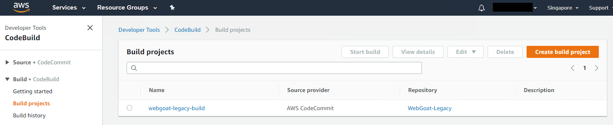

**Step2** : Setup the build as required
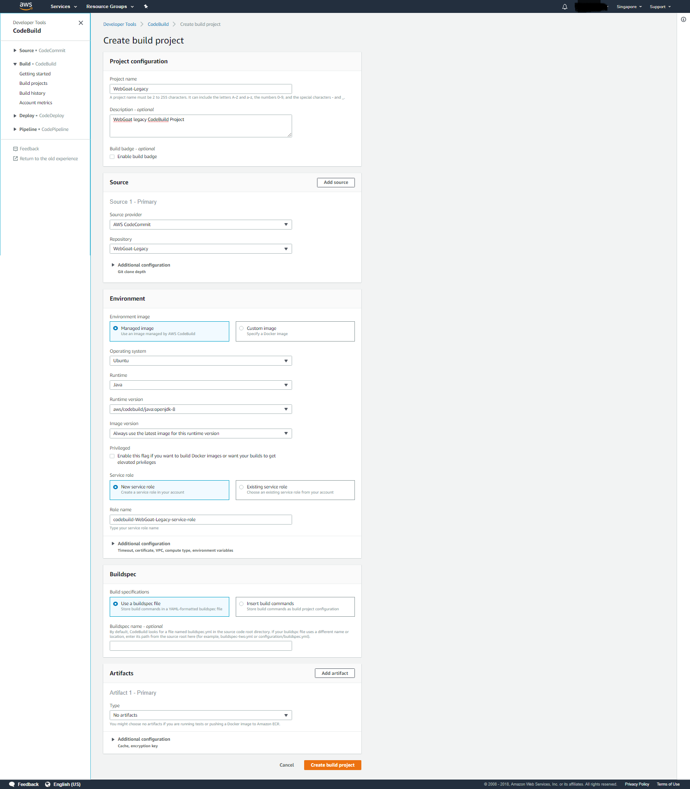

In this example, we will use a ubuntu container managed by AWS for the build. A customized docker machine can be used in-place, an important note is that the Checkmarx CLI Plugin requires Java(version 8 and above) and the sample buildspec file requires specific linux services i.e., apt-get, curl, unzip.

For the CodeBuild service role, do note to grant the equivalent allowed permissions as listed below;
- Read from AWS CodeCommit, required only if pulling source code from AWS CodeCommit
- Read from System Manager, this is to retrieve sensitive parameter from AWS System Manager Parameter Store

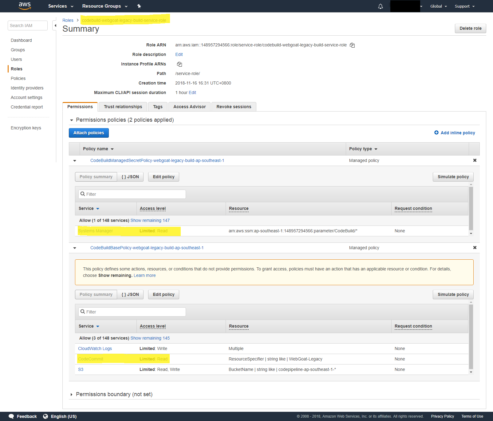

**Step3** : Add the [buildspec.yml](buildspec.yml) file to the root directory of your source code.

```yaml
version: 0.2

env:
  variables:
    CXSERVER: "https://7b9c3c8d.ngrok.io"
    PROJECTNAME: "CxServer\\WebGoat-Legacy"
    PRESET: "Checkmarx Default"
    LOCATIONTYPE: "folder"
  parameter-store:
    CXTOKEN: "CXTOKEN"
phases:
  install:
    runtime-versions:
      java: corretto8
    commands:
      - echo Entering install phase...
      - wget -O ~/cxcli.zip https://download.checkmarx.com/9.0.0/Plugins/CxConsolePlugin-2020.3.1.zip
      - unzip ~/cxcli.zip -d ~/cxcli
      - rm -rf ~/cxcli.zip
      - chmod +x ~/cxcli/runCxConsole.sh
  pre_build:
    commands:
      - echo Entering pre_build phases...
      - ~/cxcli/runCxConsole.sh Scan -v -Projectname "${PROJECTNAME}" -CxServer "${CXSERVER}" -CxToken "${CXTOKEN}" -LocationType "${LOCATIONTYPE}" -LocationPath "${CODEBUILD_SRC_DIR}" -Preset "${PRESET}"
    finally:
      - cd $CODEBUILD_SRC_DIR
  build:
    commands:
      - echo Entering build phase...
      - echo Build started on `date`
      - mvn package
  post_build:
    commands:
      - echo Entering post_build phase...
      - echo Build completed on `date`i
```

The build specification of this example CodeBuild integration consists of two phases, namely
- **install** downloads and install the CxSAST CLI plugin
- **pre-build** executes CxSAST scan via CLI plugin

The following are environment variables that is configured with the sample, do note that variables can be displayed in plain text using tools such as the AWS CodeBuild console.  

AWS offers a securestring variant 'Parameter' that is protected by the AWS System Manager Parameter store. It is recommended to protect sensitive values e.g., CxSAST Authentication Token with this mechanism. [[2]]

| Name          | Type          | Description         |
| ------------- |---------------|---------------------|
| CXSERVER      | Plaintext     | CxSAST URL          |
| PROJECTNAME   | Plaintext     | CxSAST project name |
| PRESET        | Plaintext     | Scan Preset e.g., Checkmarx Default         |
| LOCATIONTYPE  | Plaintext     | Location type i.e., folder       |
| CXTOKEN       | Parameter     | CxSAST Auth Token [[3]] |
**Note** : Variable name starting with 'CODEBUILD_' are reserved for AWS CodeBuild internal use, they should not be used in your build commands

**Step4** : Generate Checkmarx CLI Authentication Token
The plugin will use Token-based authentication for verification, follow the instructions in [[3]] to generate the token.
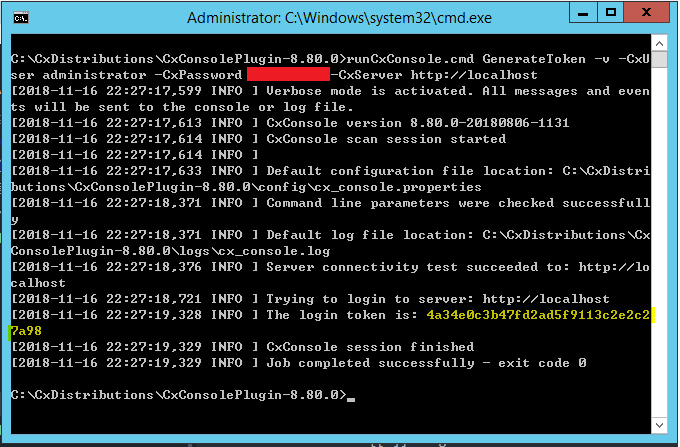

**Step5** : Edit the environment variables of the CodeBuild project
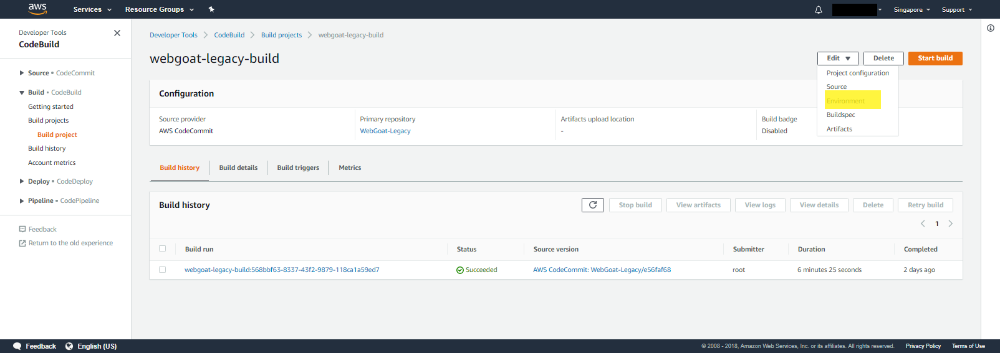

Under additional configuration, add a new Parameter named 'CXTOKEN', this is to store the CxSAST CLI Auth token.
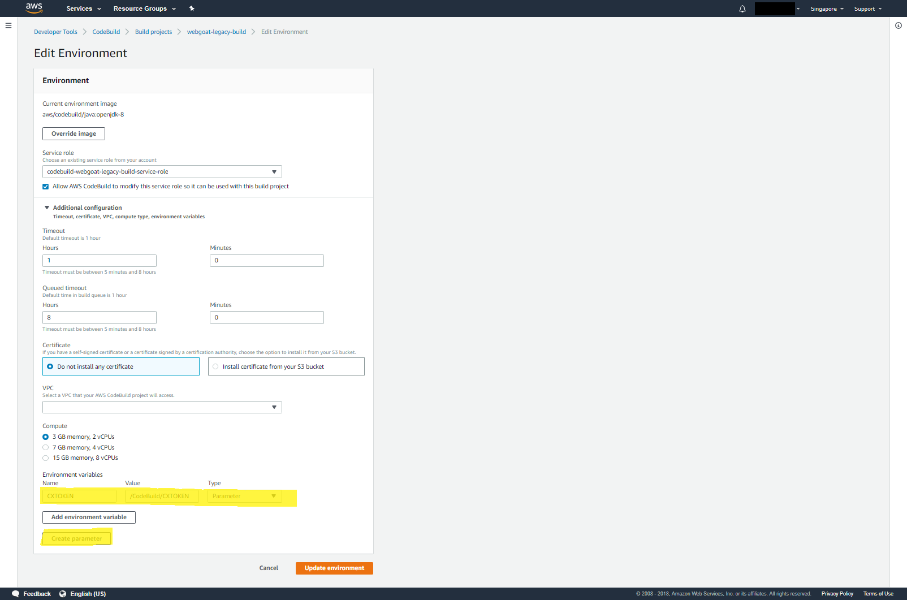
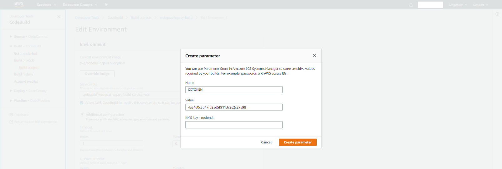

The token will be valid till revoked[[3]], should a change be required. It can be done through the AWS System Manager > Parameter Store
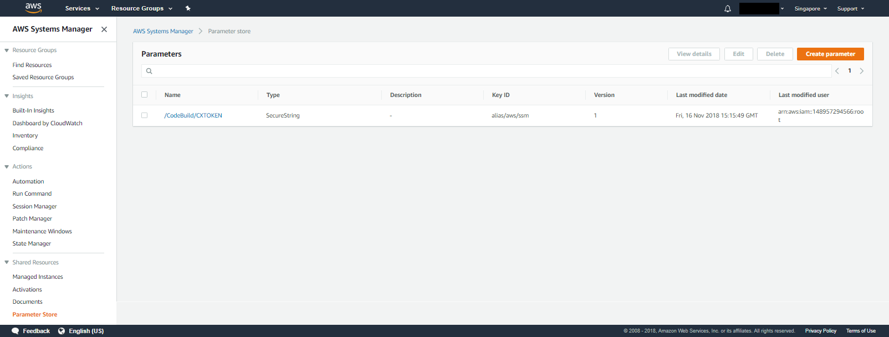

**Step6** : Start a build
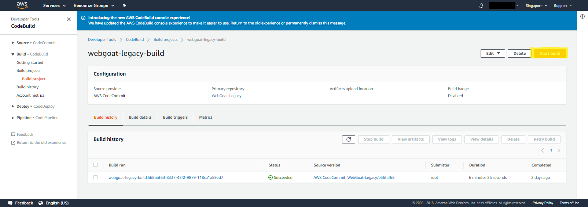

**Step7**: Observe the CLI plugin installation and start Async scan in logs

INSTALL Stage
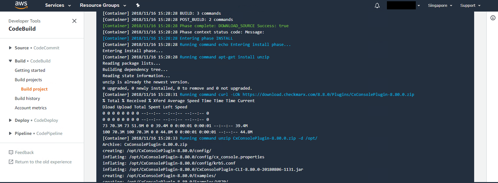

PRE_BUILD Stage
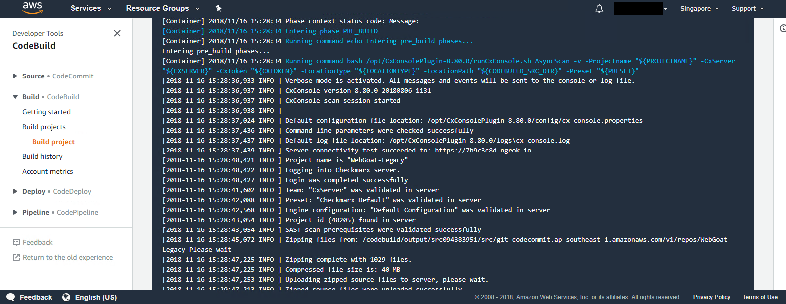

<!--
## Adding CxSAST within AWS CodeBuild using the AWS CLI
_IN WORKS_
-->

## Testing and debugging AWS CodeBuild locally
AWS supports testing and debugging CodeBuild locally [[5]], the following section will illustrate how to deploy the previous section CodeBuild integration locally

**Step 1** : Build the aws code build image [[6]], in this tutorial, we will be using [amazonlinux2-x86_64-standard:3.0](https://github.com/aws/aws-codebuild-docker-images/blob/master/al2/x86_64/standard/3.0)
```bash
git clone https://github.com/aws/aws-codebuild-docker-images.git
cd aws-codebuild-docker-images/al2/x86_64/standard/3.0
docker build -t aws/codebuild/amazonlinux2-x86_64-standard:3.0 .
```

**Step 2** : Pull the CodeBuild local agent(this is invoked in the script in Step 3).

```bash
docker pull amazon/aws-codebuild-local:latest --disable-content-trust=false
```

**Step 3** : Download and use the [codebuild_build.sh](https://raw.githubusercontent.com/aws/aws-codebuild-docker-images/master/local_builds/codebuild_build.sh) script to run your local builds.

```bash
wget https://raw.githubusercontent.com/aws/aws-codebuild-docker-images/master/local_builds/codebuild_build.sh
chmod +x codebuild_build.sh
```

**Step 4** : Clone your project repository. In this example, we are going to use the modified [WebGoat-Legacy project](https://github.com/cx-demo/WebGoat-Legacy)
```bash
git clone https://github.com/cx-demo/WebGoat-Legacy.git
git checkout Feature-awscodebuild
```

**Step 5**: Use the local agent to build the sample project

```bash
mkdir -p environment/artifacts
./codebuild_build.sh -i aws/codebuild/amazonlinux2-x86_64-standard:3.0 -a ./environment/artifacts -s /Webgoat-Legacy
```

Refer to [AWS Local Build Options](https://github.com/aws/aws-codebuild-docker-images/tree/master/local_builds)
```bash
usage: codebuild_build.sh [-i image_name] [-a artifact_output_directory] [options]
```

*Required:*

-i    Used to specify the customer build container image.

-a   Used to specify an artifact output directory.

*Optional:*

-s    Used to specify a source directory. Defaults to the current working directory.

-c    Use the AWS configuration and credentials from your local host. This includes ~/.aws and any AWS_* environment variables.

-b    Used to specify a buildspec override file. Defaults to buildspec.yml in the source directory.

-e    Used to specify a file containing environment variables.

*Environment variable file format:*
- Expects each line to be in VAR=VAL format
- Lines beginning with # are processed as comments and ignored
- Blank lines are ignored
- File can be of type .env or .txt
- There is no special handling of quotation marks, meaning they will be part of the VAL


## References
Build Specification Reference for AWS CodeBuild [[1]]  
Environment Variables in AWS CodeBuild [[2]]  
Authentication / Login to the CxSAST/CxOSA CLI [[3]]  
Test and debug locally with the AWS CodeBuild agent [[4]]  
Announcing local build support for aws codebuild [[5]]  
AWS CodeBuild Docker Images [[6]]  
Docker images provided by CodeBuild [[7]]

[1]:https://docs.aws.amazon.com/codebuild/latest/userguide/build-spec-ref.html#build-spec-ref-syntax "Build Specification Reference for AWS CodeBuild"  
[2]:https://docs.aws.amazon.com/codebuild/latest/userguide/build-env-ref-env-vars.html "Environment Variables in CodeBuild"  
[3]:https://checkmarx.atlassian.net/wiki/spaces/KC/pages/222232891/Authentication+Login+to+the+CxSAST+CxOSA+CLI "Authentication / Login to the CxSAST/CxOSA CLI"
[4]:https://docs.aws.amazon.com/codebuild/latest/userguide/use-codebuild-agent.html "Test and debug locally with the AWS CodeBuild agent"
[5]:https://aws.amazon.com/blogs/devops/announcing-local-build-support-for-aws-codebuild/ "Announcing local build support for aws codebuild"
[6]:https://github.com/aws/aws-codebuild-docker-images "AWS CodeBuild Docker Images"
[7]: https://docs.aws.amazon.com/codebuild/latest/userguide/build-env-ref-available.html "Docker images provided by CodeBuild"