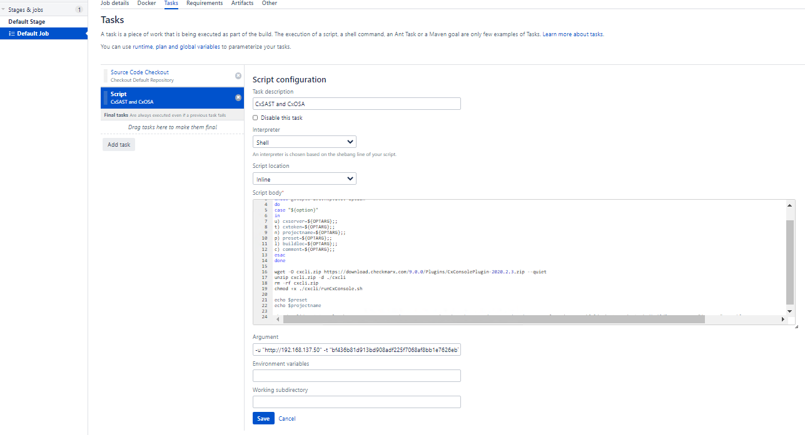

# Scripting via Checkmarx CLI to invoke scans
* Author:   Pedric Kng  
* Updated:  24 May 2020

Powershell and Bash script for invoking scans on Windows and Linux platform respectively.

***

## Sample scripts
[Powershell script for Windows](CxCLI.ps1)  

| Arguments     | Description               |
| ------------- |---------------------------|
| -cxserver     | Checkmarx server URL      |
| -cxtoken      | Checkmarx authentication token   |
| -projectname  | Checkmarx project full name and path e.g., CxServer\EasyBuggy |
| -preset       | Checkmarx scan preset  e.g., Checkmarx Default  |
| -buildloc     | Scan source location  |
| -comment      | Scan comments |

[Bash script for Linux](CxCLI.sh)

| Arguments     | Description               |
| ------------- |---------------------------|
| -u            | Checkmarx server URL      |
| -t            | Checkmarx authentication token   |
| -n            | Checkmarx project full name and path e.g., CxServer\EasyBuggy |
| -p            | Checkmarx scan preset     |
| -l            | Scan source location  |
| -c            | Scan comments |


## Powershell Script Example : Configuring script task on Bamboo Windows agent
Bamboo can be configured with script task invoking the Powershell script

- Interpreter:  Windows Powershell
- Script Location:  Inline
- Script Body:

```ps1
param (
    [Parameter(Mandatory, HelpMessage="cxserver")]
	[string]$cxserver,

    [Parameter(Mandatory, HelpMessage="cxtoken")]
	[string]$cxtoken,

    [Parameter(Mandatory, HelpMessage="projectname")]
	[string]$projectname,

    [Parameter(HelpMessage="preset, default=Checkmarx Default")]
	[string]$preset = "Checkmarx Default",

    [Parameter(Mandatory, HelpMessage="Build Location")]
	[string]$buildloc,

     [Parameter(Mandatory, HelpMessage="Comment")]
	[string]$comment
)

#URL for Checkmarx CLI Tool
$url = "https://download.checkmarx.com/9.0.0/Plugins/CxConsolePlugin-2020.2.3.zip"

#name of the file
$zipfile = "CxConsolePlugin-2020.2.3.zip"
$dest = "CxConsolePlugin-2020.2.3"

#download file
(New-Object System.Net.WebClient).DownloadFile($url, $zipfile)

#unzip file provided in variable to script root
Expand-Archive $zipfile -Force

Write-Host "scanning with"
Write-Host "./runCxConsole.cmd scan -v -cxserver '$cxserver' -cxtoken '$cxtoken' -projectname '$projectname' -locationtype 'folder' -locationpath '$buildloc' -preset '$preset' -enableosa -executepackagedependency"

cd $dest

./runCxConsole.cmd scan -v -cxserver $cxserver -projectname $projectname -cxtoken $cxtoken -locationtype 'folder' -locationpath $buildloc  -preset $preset -enableosa -executepackagedependency -Comment $comment
```

- Argument:
```bash
-cxserver "http://192.168.137.50" -cxtoken "bf436b81d913bd908adf225f7068af8bb1e7626eb731a6305680e9d699ed9b39" -projectname "CxServer\easybuggy" -preset 'Checkmarx Default' -buildloc "${bamboo.build.working.directory}" -comment "${bamboo.buildResultKey}"
```

## Bash Script Example : Configuring script task on Bamboo Linux agent
Bamboo can be configured with script task invoking the Bash script indirectly invoking a Checkmarx scan

### Pre-requisites
The following linux packages are required  
wget - download Checkmarx CLI  
unzip - unzip the downloaded Checkmarx CLI  

### Configuration
 

- Interpreter:  SHELL
- Script Location:  Inline
- Script Body:

```bash
#!/bin/sh

while getopts u:t:n:p:l:c: option
do
case "${option}"
in
u) cxserver=${OPTARG};;
t) cxtoken=${OPTARG};;
n) projectname=${OPTARG};;
p) preset=${OPTARG};;
l) buildloc=${OPTARG};;
c) comment=${OPTARG};;
esac
done

wget -O cxcli.zip https://download.checkmarx.com/9.0.0/Plugins/CxConsolePlugin-2020.2.3.zip --quiet
unzip cxcli.zip -d ./cxcli
rm -rf cxcli.zip
chmod +x ./cxcli/runCxConsole.sh

sh ./cxcli/runCxConsole.sh scan -v -cxserver "$cxserver" -cxtoken "$cxtoken" -projectname "$projectname" -locationtype 'folder' -LocationPath "$buildloc" -preset "$preset" -enableosa -executepackagedependency -Comment "$comment"
```

- Argument:
```bash
-u "http://192.168.137.50" -t "bf436b81d913bd908adf225f7068af8bb1e7626eb731a6305680e9d699ed9b39" -n "CxServer\easybuggy" -p 'Checkmarx Default' -l "${bamboo.build.working.directory}" -c "${bamboo.buildResultKey}"
```

## References
Bamboo configuring a builder task [[1]]  

[1]:https://confluence.atlassian.com/bamboo/script-289277046.html "Bamboo configuring a builder task"