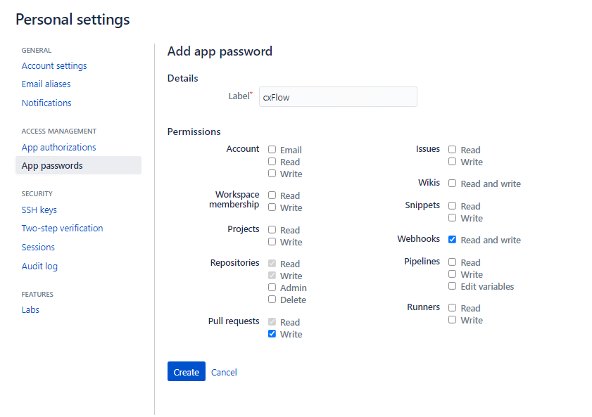
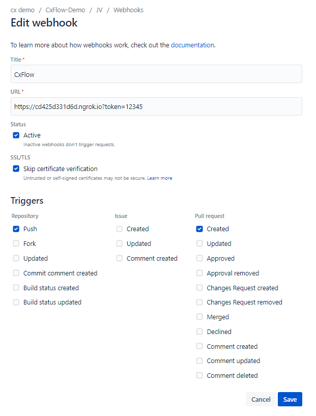
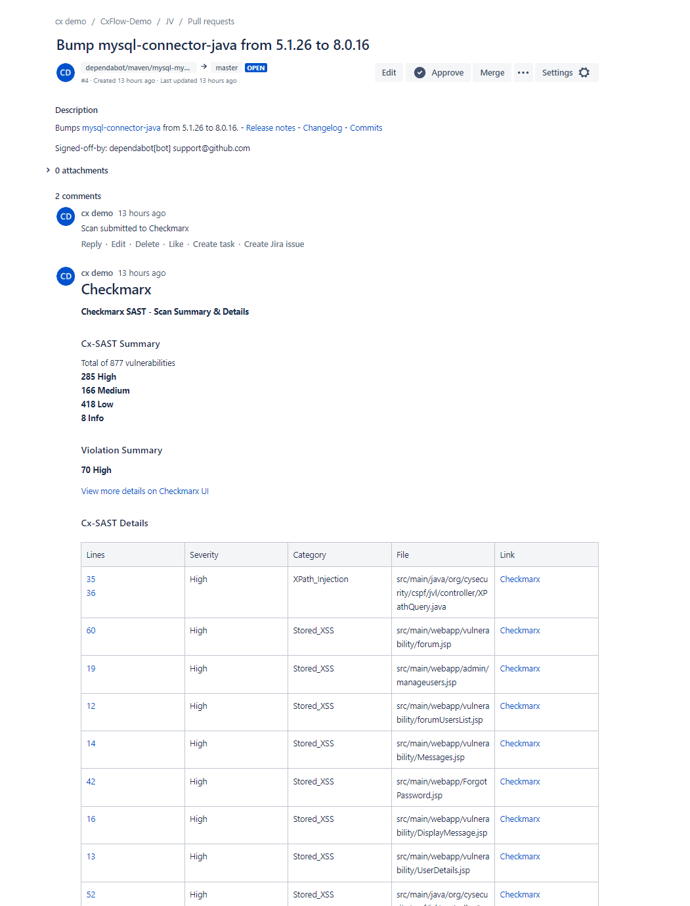

# CxFlow with Bitbucket Cloud
* Author:   Pedric Kng  
* Updated:  *IN-WORKS*


In this article, we will integrate CxFlow with Bitbucket Cloud. 
- [Pull/Push request scan via CxFlow web mode](#Pull/Push-request-scan-via-CxFlow-web-modet)

<!--
- [Pull/push request scan via CxFlow CLI mode in Bitbucket Pipeline](#Pull/push-request-scan-via-CxFlow-CLI-mode-in-Bitbucket-Pipeline)
-->

See [CxFlow wiki](https://github.com/checkmarx-ltd/cx-flow/wiki) for more information.


# Pull/Push request scan via CxFlow web mode

CxFlow can be deployed as a web service that listens for webhooks request from various SCM e.g., pull or push request.

## Pre-requisites
1. Download CxFlow jar [[6]]

2. Setup App Password on BitBucket Cloud

    *[Personal Setting] > App Passwords > Create*

    

    | Fields | Type | Configuration |
    | ------------- |---------------|---------------------|
    | Label | Textfield | Free-text label e.g., CxFlow  |
    | Pull requests > Read, Write | Checkbox | 	✔ |
    | Webhooks > Read and write | Checkbox | ✔ |

        Please note down the generated password, to be specified with the CxFlow yml configuration.

3. Setup Webhook

    *[Project] > Respository settings > Wehooks > Add Webhook*

    

    | Fields | Type | Configuration |
    | ------------- |---------------|---------------------|
    | Title | Textfield | URL To CxFlow web e.g., https://\<cxflow\>?token=12345. The token is required for CxFlow yml configuration  authentication with CxFlow. |
    | Status/Active | Checkbox | ✔ |
    | Skip certificate verification | Checkbox | ✔ |
    | Triggers > Push, Pull request -> Created| Checkbox | ✔ |
    

## CxFlow configuration

CxFlow configuration can be passed in via YAML[[8]] and override via web hook[[9]] or command arguments.

We will walktrough some important configuration below, using [example](webmode/application-bitbucket.yml).

| Configuration | Description |
| ------------- |---------------|
| checkmarx.username | CxSAST login username |
| checkmarx.password | CxSAST login password |
| checkmarx.base-url | CxSAST URL e.g., http://<CxSAST URL> |
| checkmarx.team | CxSAST team e.g., /CxServer/CxFlow/Bitbucket |
| bitbucket.webhook-token | token specified with webhook (https://\<cxflow\>?token=12345) token e.g., 12345 |
| bitbucket.token | \<username\>:\<App password\> |
  
CxFlow includes two mechanism to filtrate results and fail pipeline/block [[7]]
  
  - Filter issues via severity, category, state, CWE Id
    
    | Configuration | Description |
    | ------------- |---------------| 
    | cxflow.filter-severity | Filter issues by severity i.e., High, Medium, Low, Informational |
    | cxflow.filter-category | Filter issues by vulnerability category e.g., Stored_XSS, SQL_Injection |
    | cxflow.filter-cwe | Filter issues by CWE Id e.g., 89 - Injection |
    | cxflow.filter-state | Filter by triaged issues i.e., To Verify, Confirmed, Urgent and Proposed Not Exploitable. |
    
  - Fail by severity threshold
    
    | Configuration | Description |
    | ------------- |---------------| 
    | cxflow.thresholds.high | break build if number of 'High' severity issues exceed threshold |
    | cxflow.thresholds.medium | break build if number of 'Medium' severity issues exceed threshold |
    | cxflow.thresholds.low | break build if number of 'Low' severity issues exceed threshold |

        Note that the threshold is applied on the number of findings after filtering, if filtering is applied.

CxFlow can be configured to automate Jira tickets upon push request
- Add Jira configuration for push request *IN-WORKS*


## Execute CxFlow in web mode

```bash
java -jar cx-flow-1.6.22.jar --spring.config.location="<path\to>\application-bitbucket.yml" --web
```

## Triggering flow
- Pull request
  
  Upon triggering a pull request, the webhook sends request to trigger a scan.
  Post to the scan, CxFlow will process the results and add the summary to the pull request comments.
  
  

- Push request

  Upon triggering a push request, the webhook sends requires to trigger a scan.
  Post to the scan, CxFlow will process the results, and create tickets in the associated Jira.

## Miscellenous

- Designate a PR project
  For pull request scan, CxFlow will create scan under CxSAST project name '<repo>-<branch>'. To enforce the scan under a particular project, either use wehook overrides[[9]] or external groovy script[[11]].
  
  Script example [myproject.goovy](webmode/myproject.groovy), this designate a single SAST project '<repo>-PR' for all pull requests.

  | Configuration | Description |
  | ------------- |---------------| 
  | checkmarx.project-script | Groovy script to customize project name |

- Adding comments
  Similar option is available as per 'Designate a PR project', see example [[mycomments.groovy]](webmode/mycomments.groovy).

  | Configuration | Description |
  | ------------- |---------------| 
  | checkmarx.project-script | Groovy script to customize project name |


<!--
# Pull/push request scan via CxFlow 'CLI mode' in Bitbucket Pipeline
 *IN-WORKS*
-->


## References
CxFlow Dockerhub [[1]]  
CxFlow Github repository [[2]]  
Example Bitbucket CxFlow Pipeline [[3]]  
Variables and secrets [[4]]  
Bitbucket Cloud Webhook Tutorial [[5]]  
CxFlow Download [[6]]  
CxFlow Threshold & Policies [[7]]  
CxFlow Configuration [[8]]  
CxFlow webhooks override [[9]]  
Example Bitbucket CxFlow Webhooks [[10]]  
CxFlow External Scripts [[11]]  

[1]:https://hub.docker.com/r/checkmarx/cx-flow "CxFlow Dockerhub"
[2]:https://github.com/checkmarx-ltd/cx-flow "CxFlow Github Repository"
[3]:https://bitbucket.org/cxdemosg/webgoat "Example Bitbucket CxFlow Pipeline"
[4]:https://support.atlassian.com/bitbucket-cloud/docs/variables-and-secrets/ "Variables and secrets"
[5]:https://github.com/checkmarx-ltd/cx-flow/wiki/Tutorials#bitbucket "Bitbucket Cloud Webhook Tutorial"
[6]:https://github.com/checkmarx-ltd/cx-flow/tags "CxFlow download"
[7]:https://github.com/checkmarx-ltd/cx-flow/wiki/Thresholds-and-policies "CxFlow Threshold & Policies"
[8]:https://github.com/checkmarx-ltd/cx-flow/wiki/Configuration "CxFlow Configuration"
[9]:https://github.com/checkmarx-ltd/cx-flow/wiki/Configuration#details "CxFlow webhooks override"
[10]:https://bitbucket.org/cxdemosg/jv "Example Bitbucket CxFlow Webhooks"
[11]:https://github.com/checkmarx-ltd/cx-flow/wiki/External-Scripts "CxFlow External scripts"