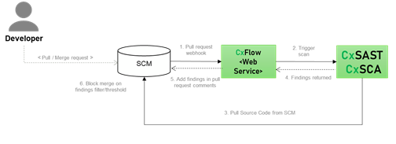
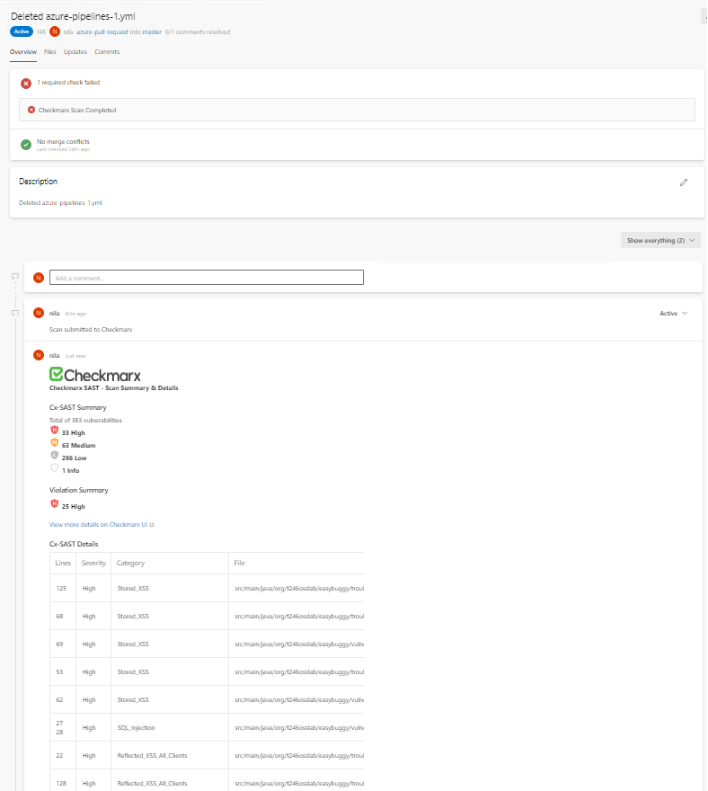
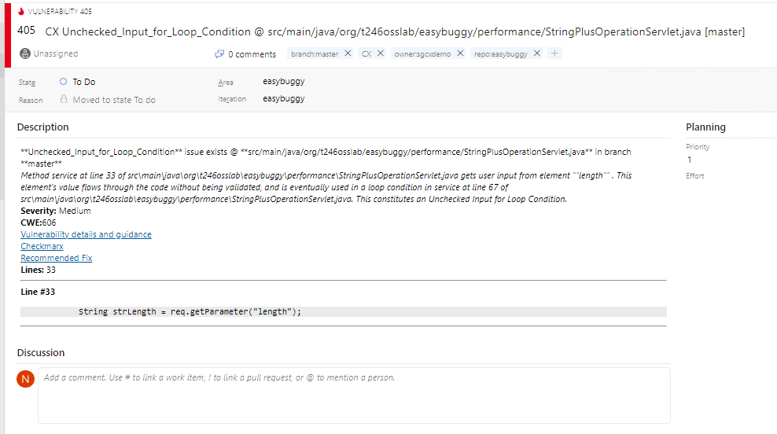
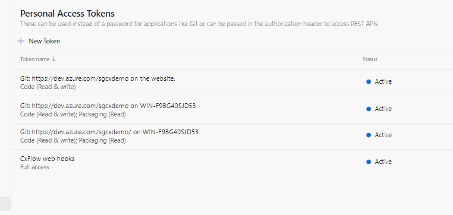
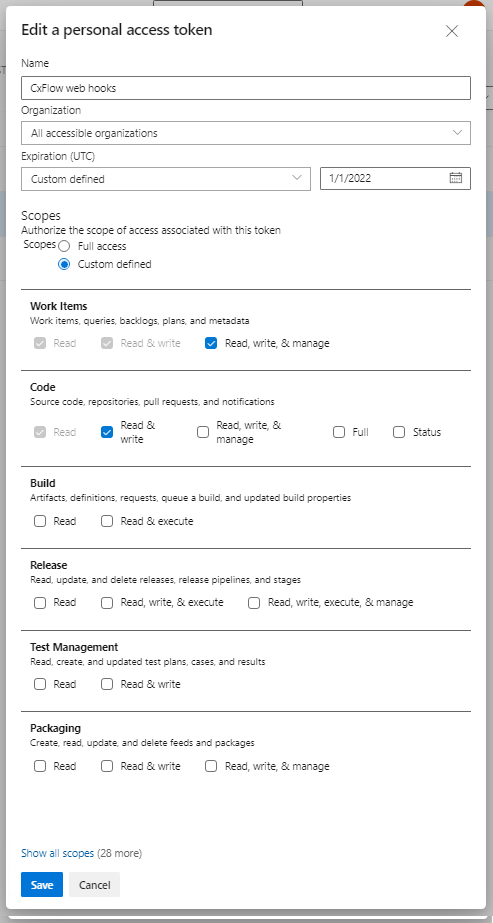
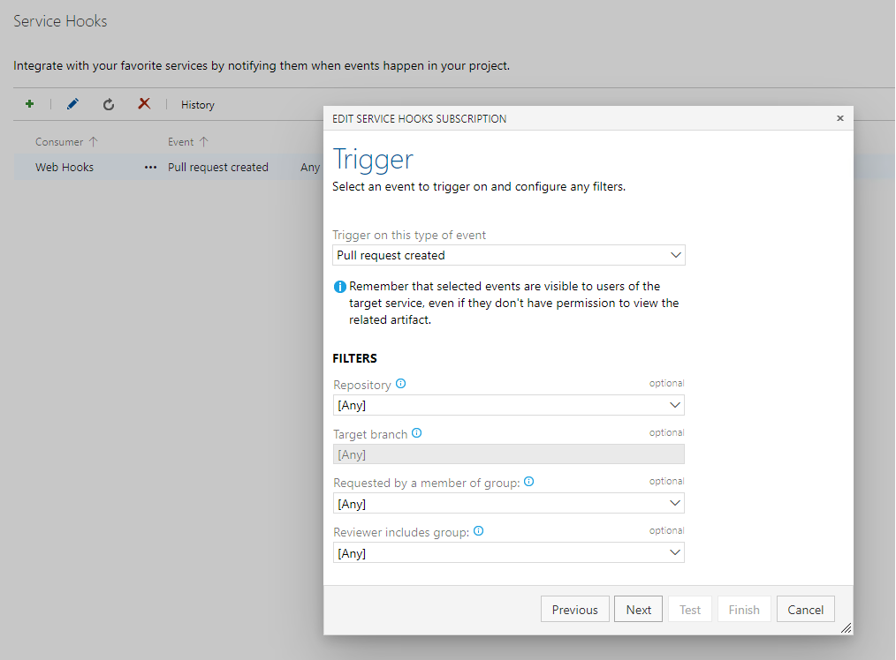
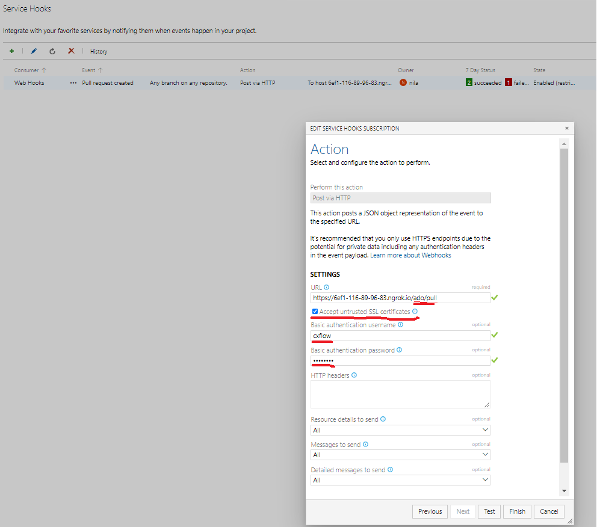
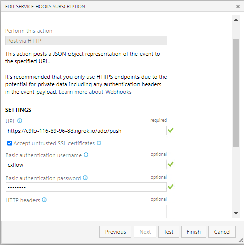
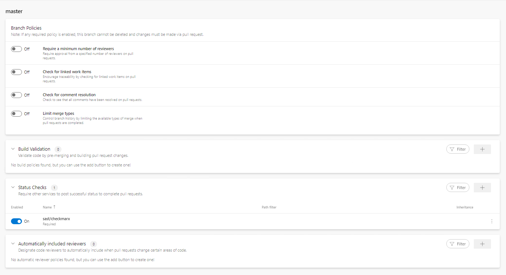

# CxFlow webhooks with Azure DevOps

* Author:   Pedric Kng  
* Updated:  30 Aug 2021


This guide documents CxFlow webhook with AzureDevOp Cloud integration. 

***

# Pull/Push request scan via CxFlow web mode

CxFlow can be deployed as a web service that listens for webhooks request from various SCM e.g., pull or push request.

In this example, we will deploy it as a docker container.



Depending on what type of events is triggered, CxFlow will process the results accordingly and update;

- Pull/Merge Request
    - Add finding summary in pull/merge request comments
    - Block merge 
    
    


- Push/Commit Request
    - Add issues in Azure DevOps Work Items

    


See [CxFlow wiki](https://github.com/checkmarx-ltd/cx-flow/wiki) for more information.

# Pre-requisites

1. Download CxFlow Docker Container [[1]]

2. Setup Access Token on Azure DevOps

    *[User Settings] > Personal Access Token > New Token*

    

    - Azure DevOps Access Token
      The Azure Access Token that needs to be configured with CxFlow needs to have the following requirements for both Push and Pull Request events:
        - Code (Read & write)
        - Work Items (Read, write, & manage)
    
      

      Please note down the generated password, to be specified with the CxFlow yml configuration.

3. Setup Webhook

    *[Project] > Project Settings > Service hooks > '+'*

    

   - Pull Request

    

    | Fields | Type | Configuration |
    | ------------- |---------------|---------------------|
    | Trigger | Dropdown | Pull request created |
    | URL | Textfield | URL To CxFlow web e.g., https://\<cxflow\>/ado/pull |
    | Accept untrusted SSL certificates | Textfield | ✔ |
    | Basic authentication username | Textfield | CxFlow authentication label e.g., cxflow |
    | Basic authentication password | Textfield | CxFlow authentication token e.g., 12345 |

   - Push Request

    

    | Fields | Type | Configuration |
    | ------------- |---------------|---------------------|
    | Trigger | Dropdown | Code Pushed |
    | URL | Textfield | URL To CxFlow web e.g., https://\<cxflow\>/ado/push |
    | Accept untrusted SSL certificates | Textfield | ✔ |
    | Basic authentication username | Textfield | CxFlow authentication label e.g., cxflow |
    | Basic authentication password | Textfield | CxFlow authentication token e.g., 12345 |


4. Enforce branch policy to block merge

   *[Project] > Repos > Branches > [Merge Branch] > Branch Policy*

   

    Enable the 'Status Checks' for sast/checkmarx, note that the service is only available for selection after an initial scan
    
## CxFlow configuration

CxFlow configuration can be passed via different means depending on the environment e.g., YAML, Webhook override, command arguments, env file [[3]]

In this tutorial, the configuration is passed in via an environment file and i will walkthrough using the [example](cxflow.env).

| Configuration | Description |
| ------------- |---------------|
| CHECKMARX_VERSION | CxSAST version e.g., 9.0 |
| CHECKMARX_USERNAME | CxSAST login username |
| CHECKMARX_PASSWORD | CxSAST login password |
| CHECKMARX_BASE_URL | CxSAST URL e.g., http://<CxSAST URL> |
| CHECKMARX_TEAM | CxSAST team e.g., /CxServer/CxFlow/AzureDevOps |
| SCA_APPURL | CxSCA URL i.e., US-https://sca.checkmarx.net, EU-https://eu.sca.checkmarx.net |
| SCA_APIURL | CxSCA API URL i.e., US-https://api-sca.checkmarx.net, EU-https://eu.api-sca.checkmarx.net |
| SCA_ACCESSCONTROLURL | CxSCA Access Control URL i.e., https://platform.checkmarx.net |
| SCA_TENANT | CxSCA tenant |
| SCA_USERNAME | CxSCA username |
| SCA_PASSWORD | CxSCA password |
| SCA_FILTER_SEVERITY | Filter CxSCA issues by severity E.g., High, Medium |
| CXFLOW_BUG_TRACKER | CxFlow bug tracker e.g., Azure |
| CXFLOW_BUG_TRACKER_IMPL | CxFlow bug tracker implementation e.g., Azure |
| CXFLOW_BRANCHES | Allowed SCM branches to execute CxFlow e.g., master |
| CXFLOW_FILTER_SEVERITY |  Filter CxSAST issues by severity E.g., High, Medium |
| AZURE_WEBHOOK_TOKEN | Azure authentication label and token <label:token> e.g., cxflow:12345 |
| AZURE_TOKEN | Azure personal access token |
| AZURE_ISSUE_TYPE | Azure issue type e.g., issue |
| AZURE_API_VERSION | Azure API version i.e., 5.0 |
| AZURE_FALSE_POSITIVE_LABEL | e.g., false-positive |
| AZURE_BLOCK_MERGE | Block merge when it exceed filter/threshold e.g., true |
| AZURE_CLOSED_STATUS| Azure work item 'closed' status e.g., Done |
| AZURE_OPEN_STATUS | Azure work item 'open' status e.g., To Do |

## Execute CxFlow in web mode

```bash
docker pull checkmarx/cx-flow:1.6.22
docker run --rm --env-file='./cxflow.env' --name=cx-flow --detach -p 8982:8585 checkmarx/cx-flow:1.6.22
```


## References
CxFlow Dockerhub [[1]]  
CxFlow Github repository [[2]]  
CxFlow Configuration [[3]]  

[1]:https://hub.docker.com/r/checkmarx/cx-flow "CxFlow Dockerhub"
[2]:https://github.com/checkmarx-ltd/cx-flow "CxFlow Github Repository"
[3]:https://github.com/checkmarx-ltd/cx-flow/wiki/Configuration "CxFlow Configuration"  