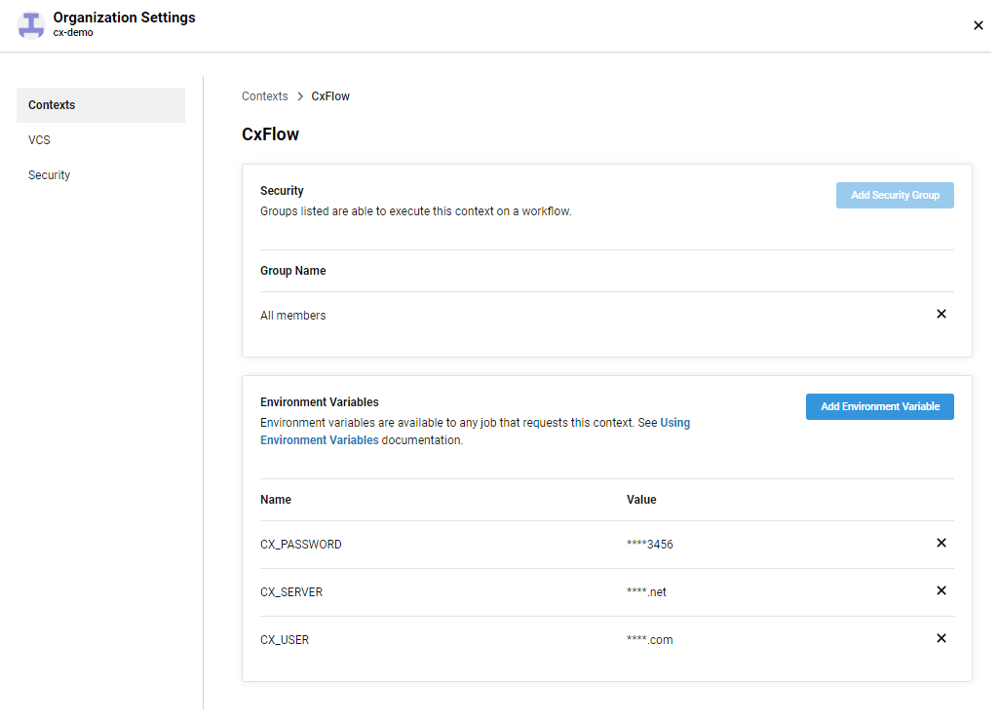
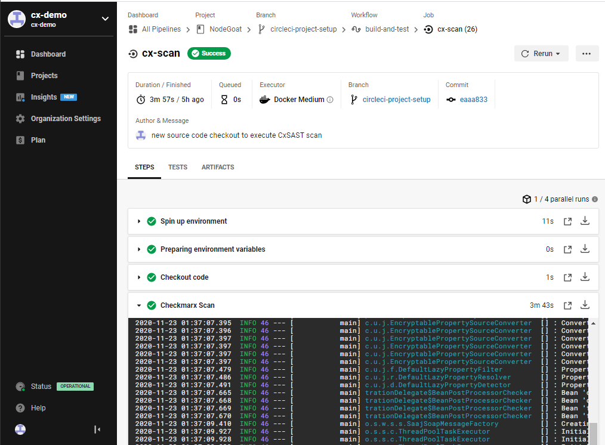

# CxFlow with CircleCI
* Author:   Pedric Kng  
* Updated:  26 Oct 2020

## Overview
Cxflow Circle CI Orb offers integration into the pipeline to execute Checkmarx security scans (CxSAST) or to retrieve existing scan results

In this tutorial, we will be using the [scan command](https://circleci.com/developer/orbs/orb/checkmarx-ts/cxflow#usage-checkmarx-scan-command) to execute scans and store the JSON report.

***
## Pre-requisites
- Checkmarx CxFlow Circle CI Orb [[1]] 

  The Checkmarx CircleCI Orb spin up a CxFlow docker container and execute via passing respective arguments. 
  
- Checkmarx CxSAST 8.9/9.x

## Configuration
**Step1** : Add the CxFlow Circle CI Orb in your config.yml

```yml
version: 2.1
orbs:
  cxflow: checkmarx-ts/cxflow@1.0.4
  ...
```

**Step2** : Define a checkmarx scan job 'cx-scan', and add the 'cxflow/scan' step, post to checkout of the source code. 

Note that the files to be scanned will be retrieved from the current directory (Default: '~/project'), can also be refered to as $CIRCLE_WORKING_DIRECTORY.

```yml
jobs:
  cx-scan:
   executor: cxflow/default
    steps:
      - checkout
      - cxflow/scan:
          project: '${CIRCLE_PROJECT_REPONAME}-${CIRCLE_BRANCH}'
          preset: 'Checkmarx Default'
          version: '9.0'
          checkmarx-url: ${CX_SERVER}
          team: '${CX_TEAM}'
          apply-filters: '--filter-severity=High'
          incremental: true
          params: '--checkmarx.username=${CX_USER} --checkmarx.password=${CX_PASSWORD} --checkmarx.incremental-num-scans=1 --checkmarx.incremental-threshold=7 --cx-flow.break-build=true'
          report-file: 'checkmarx.json'
          
      - store_artifacts:
          path: 'checkmarx.json'
...
```

The [CxFlow Orb configuration](https://circleci.com/developer/orbs/orb/checkmarx-ts/cxflow#commands-results) can be passed in via project or organization context environment variables. 

In example above, i have specified 
- incremental scan
- to fail build upon detecting high severity issues
- store scan JSON report

Advanced CxFlow configuration have been extended via the 'params' configuration, refer to [CxFlow Wiki](https://github.com/checkmarx-ltd/cx-flow/wiki) for details.

**Step3** : Configure the 'cx-scan' job in the workflow, we will use the organization context 'CxFlow' to contain global secrets and filter only scanning on 'circleci-project-setup' branch.

```yml
workflows:
    version: 2
    build-and-test:
      jobs:
        - cx-scan:
            context: CxFlow # use usage of organization context 'Checkmarx' for environment variables
            filters:
              branches:
                only: circleci-project-setup
...

```

 

| Name | Description | Example |
| ---- | ---- | ---- |
| CX_SERVER | CxSAST Server URL | https://server_url |
| CX_USER | CxSAST service user | |
| CX_PASSWORD | CxSAST service password |  |
| CX_TEAM| CxSAST team | /CxServer/SP/APAC/sgcxdemo |


Execute the pipeline and view the scanning

 


## References
CxFlow Circle CI Orb [[1]]  
CxFlow wiki [[2]]  
Sample CxFlow Orb configuration [[3]]

[1]:https://circleci.com/developer/orbs/orb/checkmarx-ts/cxflow "CxFlow Circle CI Orb"  
[2]:https://github.com/checkmarx-ltd/cx-flow/wiki "CxFlow wiki"  
[3]:https://github.com/cx-demo/NodeGoat/blob/circleci-project-setup/.circleci/config.yml "Sample CxFlow Orb configuration"