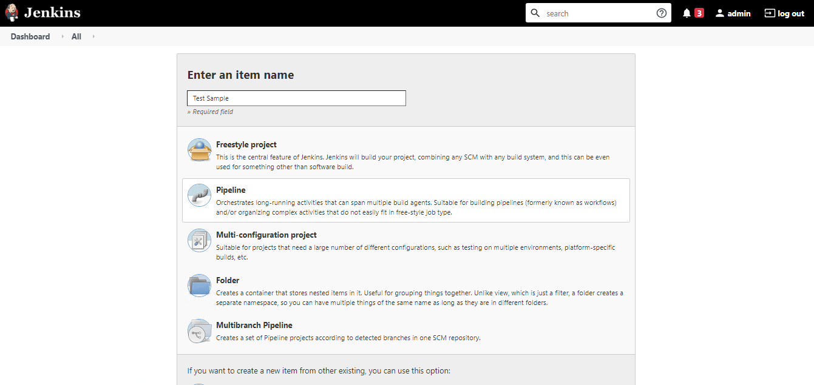
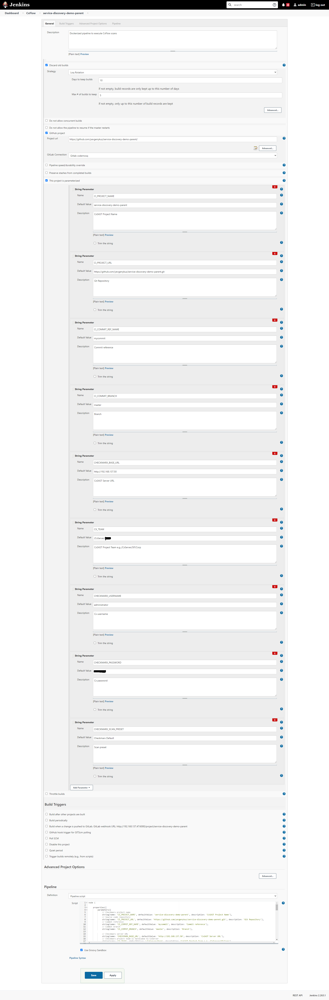
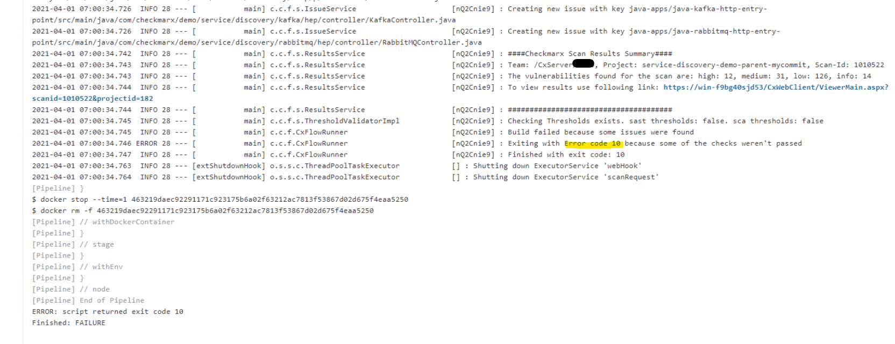

# Dockerized CxFlow with Jenkins

* Author:   Pedric Kng  
* Updated:  01 Apr 2021

## Overview
This guide illustrates dockerized cxflow integration for
1. Jenkins Scripted Pipeline
2. Execute dockerized CxFlow for SAST scan
    - Exclude files from zip upload via folder/file exclusion
    - Fail build upon detecting occurences of new issues
    - Generate CxSAST XML report

***

## Pre-requisites
- Jenkins installed with Docker CLI execution capability, refer to [[2]] for an example setup
- Availability of CxFlow docker image, refer to [[3]]
- Installed docker pipeline plugin [[4]]


## Configuration

1. Create Jenkins project of type 'Pipeline'

    


2. Configure the [Pipeline script](Jenkinsfile)
    

    ```groovy
        node {
            
            properties([
                parameters([
                    // Checkmarx project name
                    string(name: 'CI_PROJECT_NAME', defaultValue: 'service-discovery-demo-parent', description: 'CxSAST Project Name'),
                    // Source code repository
                    string(name: 'CI_PROJECT_URL', defaultValue: 'https://github.com/yevgenykuz/service-discovery-demo-parent.git', description: 'Git Repository'),
                    // Commit reference
                    string(name: 'CI_COMMIT_REF_NAME', defaultValue: 'mycommit', description: 'Commit reference'),
                    // Commit branch
                    string(name: 'CI_COMMIT_BRANCH', defaultValue: 'master', description: 'Branch'),
            
                    // Checkmarx server URL
                    string(name: 'CHECKMARX_BASE_URL', defaultValue: 'https://<mycxsast>', description: 'CxSAST Server URL'),
                    // Checkmarx project team is hardcoded to CxServer
                    string(name: 'CX_TEAM', defaultValue: '/CxServer', description: 'CxSAST Project Team e.g.,/CxServer/SP/Corp'),
            
                //Checkmarx username
                string(name: 'CHECKMARX_USERNAME', defaultValue: 'administrator', description: 'Cx username'),
                //Checkmarx password
                string(name: 'CHECKMARX_PASSWORD', defaultValue: '<password>', description: 'Cx password'),
                //CxSAST scan preset
                string(name: 'CHECKMARX_SCAN_PRESET', defaultValue: 'Checkmarx Default', description: 'Scan preset'),
                ])
            ])
            
            sh 'echo "Get some code from an SCM"'
            checkout([$class: 'GitSCM',
            branches: [[name: "refs/heads/${params.CI_COMMIT_BRANCH}"]],
            doGenerateSubmoduleConfigurations: false,
            extensions: [],
            submoduleCfg: [],
            userRemoteConfigs: [[credentialsId: 'Gitlab', url: "${params.CI_PROJECT_URL}"]]
            ])
            
            withEnv(['CX_FLOW_BUG_TRACKER=CxXml',
                    'CX_FLOW_BUG_TRACKER_IMPL=CxXml,Json', 
                    "CX_PROJECT=${CI_PROJECT_NAME}-${CI_COMMIT_REF_NAME}"]) {
                stage('test') {
                    docker.image('checkmarx/cx-flow').inside("--entrypoint ''") {
                        sh 'printenv'
                        sh '''
                            java -Xms512m -Xmx1024m -Djavax.net.debug=ssl,handshake \
                                -Djava.security.egd='file:/dev/./urandom' \
                                -jar /app/cx-flow.jar \
                                --scan \
                                --app=${CI_PROJECT_NAME} \
                                --branch=${CI_COMMIT_BRANCH} \
                                --cx-team=${CX_TEAM} \
                                --cx-project=${CX_PROJECT} \
                                --spring.profiles.active="sast" \
                                --f="." \
                                --cx-flow.zip-exclude="dotnet-core-apps/.*,nodejs-apps/.*" \
                                --cx-flow.filter-status=New \
                                --cx-flow.break-build=true \
                                --checkmarx.preserve-xml=true \
                                --cx-xml.file-name-format="[PROJECT]-[BRANCH]-[TIME].xml" \
                                --cx-xml.data-folder= ${WORKSPACE}
                        '''
                    }            
                }  
            }
        }
    ```
    This script contains several environment and parameter variables
    
    | Variable | Type | Description |
    | ------------- | ------------- |------------- |
    | CI_PROJECT_NAME | Paramater | CxSAST Project Name |
    | CI_PROJECT_URL | Parameter | Git Repository |
    | CI_COMMIT_BRANCH | Parameter | Commit branch |
    | CI_COMMIT_REF_NAME | Parameter | Commit reference |
    | CHECKMARX_BASE_URL | Parameter | CxSAST Server URL |
    | CX_TEAM | Parameter | CxSAST Project Team e.g.,/CxServer/SP/Corp |
    | CHECKMARX_USERNAME | Parameter | Cx username |
    | CHECKMARX_PASSWORD | Parameter | Cx password |
    | CHECKMARX_SCAN_PRESET | Parameter | Scan preset e.g., Checkmarx Default |
    | CX_FLOW_BUG_TRACKER | Env | CxFlow Bug tracker |
    | CX_FLOW_BUG_TRACKER_IMPL | Env | CxFlow Bug tracker implementation |
    | CX_PROJECT | Env | Name of project ${CI_PROJECT_NAME}-${CI_COMMIT_REF_NAME} |

    These variables will be used in the CxFlow configuration to execute CxSAST scans

    There are 2 stages within this pipeline, namely to pull source code from the git repository and execute CxSAST scan using Dockerized CxFlow. In this tutorial, we will focus on the latter and pin point several aspects;

    - CxFlow CLI execution  
    We execute CxFlow in [CLI execution mode](#L75-90). Refer to [[9]] for more information on the different use cases.
    
    - CxFlow Scan configuration  
    The various scan configuration are passed in via [environment and parameter variables](#L78-84) as configured, source code to be scanned is retrieved from the workspace ['--f'](#L84).   Refer to [[5]] for the configuration details

    - Zip Exclude  
    We excluded some folders to reduce the zip uploaded to CxSAST via the ['cx-flow.zip-exclude'](#L85)

    - Filter and break build  
    We configure CxFlow to filter for only new findings ['cx-flow.filter-status'](#L86) which will break the pipeline based on the ['cx-flow.break-build'](#L87) configuration. Refer to [[8]] for other filtering options.

    - Download XML report  
    We configure the bug tracker to be XML via ['CX_FLOW_BUG_TRACKER'](#L68) whereby the report will be downloaded and persisted in the workspace, see ['checkmarx.preserve-xml'](#L88), ['cx-xml.file-name.format'](#L89) and ['cx-xml.data-folder'](#L90). Refer to [6] for other bug tracker integration


3. Upon execution scan, the first scan will reflect 'failed' as per policy - new vulnerabilities discovered; an error code 10 will be thrown. 

    

    Subsquent scan will not reflect other 'failed' as no vulnerabilities is detected.

## References
Jenkins CI service [[1]]  
Adding docker execution environment for Jenkins [[2]]  
CxFlow Dockerhub [[3]]  
Docker Pipeline plugin [[4]]  
CxFlow configuration [[5]]  
CxFlow Bug Trackers and Feedback Channels [[6]]  
CxFlow Excluding Files from Zip Archive [[7]]  
CxFlow Filtering & Break builds [[8]]
CxFlow Execution [[9]]  

[1]: https://docs.gitlab.com/ee/integration/jenkins.html "Jenkins CI service"
[2]:https://github.com/cx-demo/myjenkins#adding-docker-execution-environment-for-jenkins "Adding docker execution environment for Jenkins"
[3]:https://hub.docker.com/r/checkmarx/cx-flow "CxFlow Dockerhub"
[4]:https://docs.cloudbees.com/docs/admin-resources/latest/plugins/docker-workflow "Docker Pipeline plugin"
[5]:https://github.com/checkmarx-ltd/cx-flow/wiki/Configuration#main "CxFlow configuration"
[6]:https://github.com/checkmarx-ltd/cx-flow/wiki/Bug-Trackers-and-Feedback-Channels "Bug Trackers and Feedback Channels"  
[7]:https://github.com/checkmarx-ltd/cx-flow/wiki/Excluding-Files-from-Zip-Archive "Excluding Files from Zip Archive"  
[8]:https://github.com/checkmarx-ltd/cx-flow/wiki/Configuration#filtering "Filtering"  
[9]:https://github.com/checkmarx-ltd/cx-flow/wiki/Execution "Execution"

<!-- Cx-Flow Github [[1]]  
Cx-Flow Demo/Development Instance [[2]]  
Injecting secret into Jenkins Build Jobs [[3]]  

[1]: https://github.com/checkmarx-ltd/cx-flow "Cx-Flow Github"  
[2]: https://github.com/checkmarx-ts/CxUtils/tree/master/CxFlowDemoInstance "Cx-Flow Demo/Development Instance"
[3]: https://support.cloudbees.com/hc/en-us/articles/203802500-Injecting-Secrets-into-Jenkins-Build-Jobs "Injecting secret into Jenkins Build Jobs"
 -->

