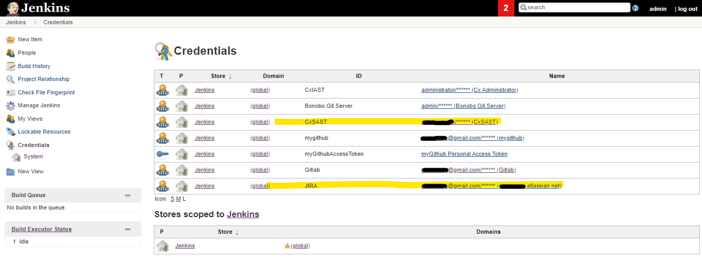
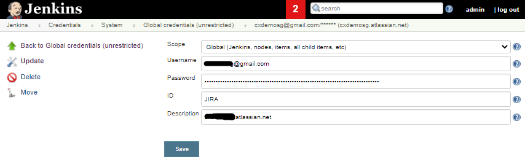
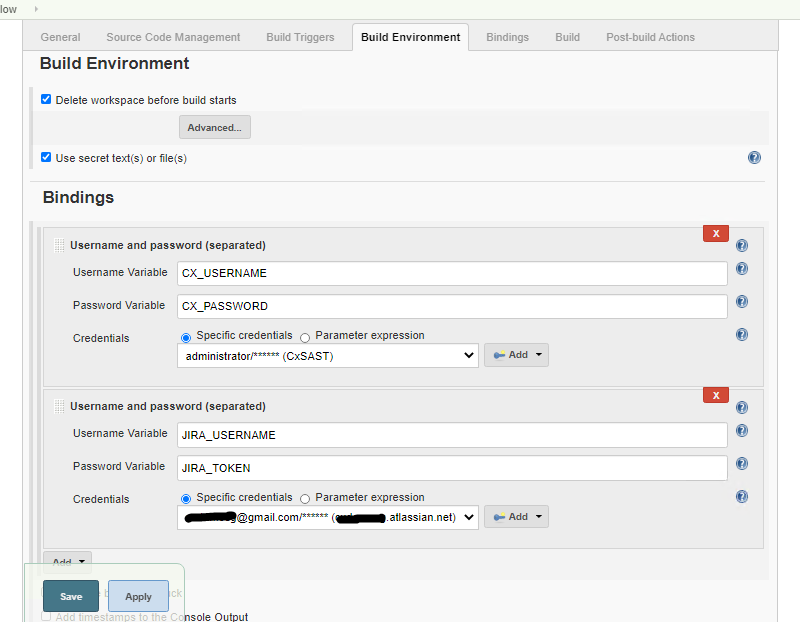
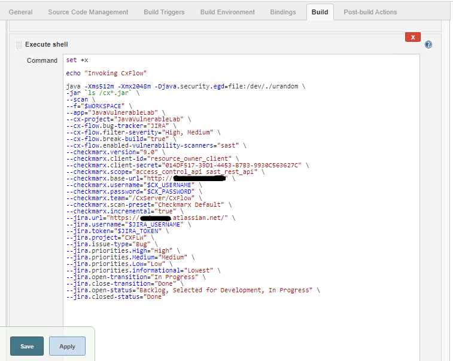
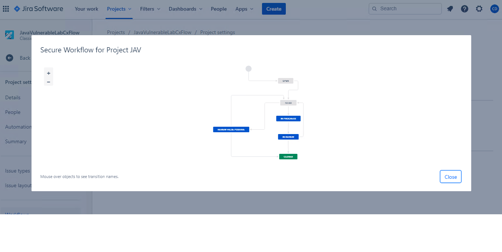
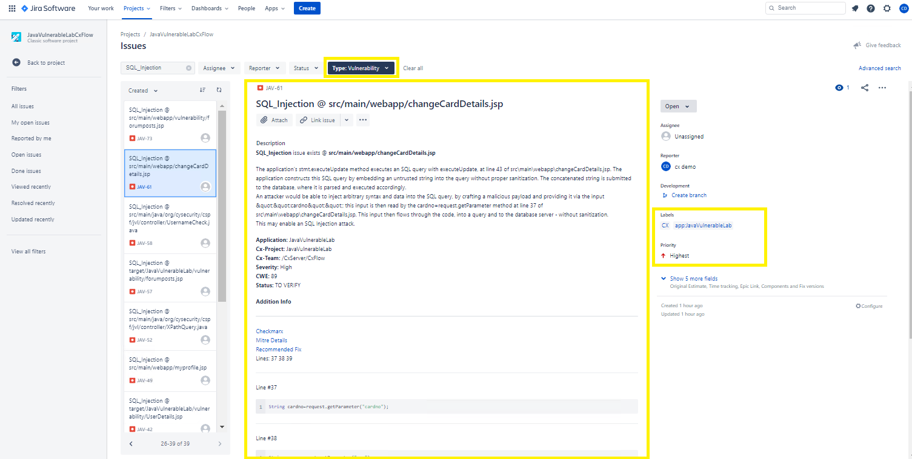
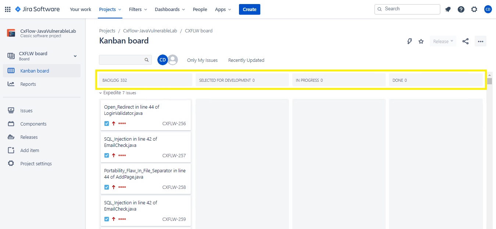
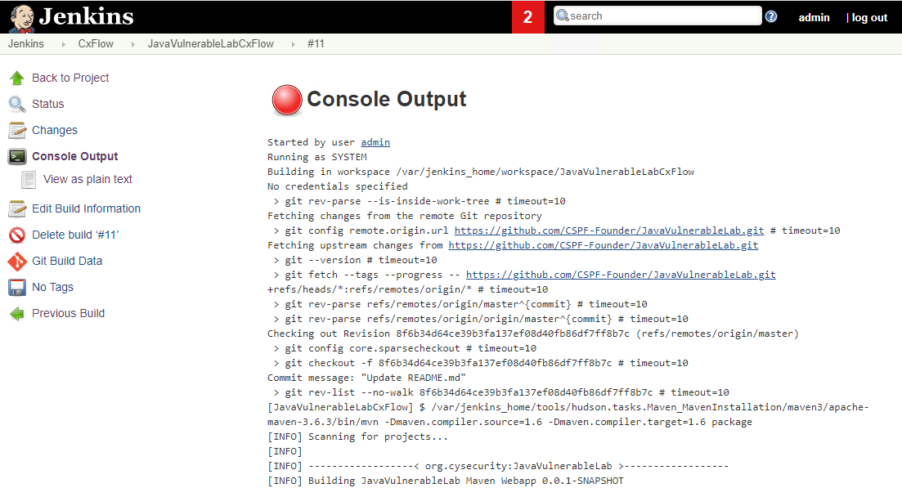
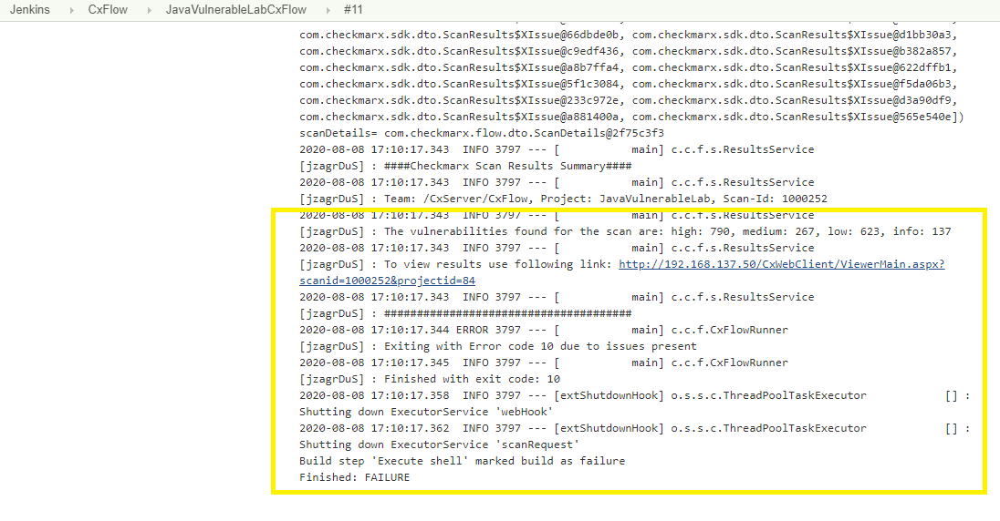

# CxFlow with Jenkins and Jira

* Author:   Pedric Kng  
* Updated:  07 Aug 2020

## Overview
This guide documents the CxFlow integration for;
1. Execute CxSAST scan via CxFlow library in a Jenkins freestyle project
2. Upon executing the scan, create/update/close tickets in Jira
3. Fail build upon detecting occurences of filtered issues by severity level

CxFlow can also support Jenkins declarative/scripted pipeline, and has flexibilty in implementation e.g., Library or Web service/Docker containter

***

## Pre-requisites
- Jenkins freestyle project
- Download [CxFlow library jar](https://github.com/checkmarx-ltd/cx-flow/releases/latest) to Jenkins runner machine
- JDK 8 or above installed on Jenkins runner
- Checkmarx CxSAST
  - CxSAST Project Name and belonging Team
  - CxSAST Username and Password
- Jira cloud
  - Jira Project Key
  - Jira Username and Token
  
## Installation
1. Create credentials in Jenkins
  - 2 pair of credentials are expected; SAST & JIRA
  
  - setup the credentials as 'Username with Password' kind
  

2. Configure secret bindings in Jenkins pipeline
   
   1. Select 'Use secret text(s) or file(s)' under 'Build Environment'
   2. Bind the following;
      - CxSAST Username and Password
      - JIRA Username and Token
      We will use these values in our build step
  
3. Add 'Execute Shell' to the build step
   

   Copy the Shell script below to the build step
    ``` bash
    set +x

    echo "Invoking CxFlow"

    java -Xms512m -Xmx2048m -Djava.security.egd=file:/dev/./urandom \
    -jar `ls /cx*.jar` \
    --scan \
    --f="$WORKSPACE" \
    --app="<project name>" \
    --cx-project="<project name>" \
    --cx-flow.bug-tracker="JIRA" \
    --cx-flow.filter-severity="High, Medium" \
    --cx-flow.break-build="true" \
    --cx-flow.enabled-vulnerability-scanners="sast" \
    --checkmarx.version="9.0" \
    --checkmarx.client-id="resource_owner_client" \
    --checkmarx.client-secret="014DF517-39D1-4453-B7B3-9930C563627C" \
    --checkmarx.scope="access_control_api sast_rest_api" \
    --checkmarx.base-url="<CxSAST URL>" \
    --checkmarx.username="$CX_USERNAME" \
    --checkmarx.password="$CX_PASSWORD" \
    --checkmarx.team="<CxSAST Team>" \
    --checkmarx.scan-preset="Checkmarx Default" \
    --checkmarx.incremental="true" \
    --jira.url="<JIRA URL>" \
    --jira.username="$JIRA_USERNAME" \
    --jira.token="$JIRA_TOKEN" \
    --jira.project="<Jira project key>" \
    --jira.issue-type="Bug" \
    --jira.priorities.High="High" \
    --jira.priorities.Medium="Medium" \
    --jira.priorities.Low="Low" \
    --jira.priorities.informational="Lowest" \
    --jira.open-transition="In Progress" \
    --jira.close-transition="Done" \
    --jira.open-status="Backlog, Selected for Development, In Progress" \
    --jira.closed-status="Done"
    ```

    - Execute CxSAST scan via CxFlow Jar library
      ```bash
      jar -jar cx-flow-<version>.jar --scan [options]
      ```
    
    - Configurable command options
      Command Option | Notes
      ------ | ----------- | ------ | ---
      f | File to be processed.  This the output from Checkmarx CLI, Jenkins/Bamboo Plugin, etc
      app | Alternatively used for Tracking purposes.  This value is also stored in the body of the issue.
      cx-project | Used to create the project in source/scan (zip) mode
      cx-flow.filter-severity | The severity should be filtered during feedback (High, Medium, Low, Informational).  If no value is provided, all severity are applicable.
      cx-flow.break-build | A non zero return code (10) is given when any of the filtering criteria is met within scan results.
      checkmarx.base-url | Base FQDN and Port for CxSAST
      checkmarx.username | CxSAST Service Account Username
      checkmarx.password | CxSAST Service Account Password
      checkmarx.team | Base team in Checkmarx to drive scanning and retrieving of results
      checkmarx.scan-preset | The default preset used for the triggered scans
      checkmarx.incremental | Enables support for Incremental scan support when CxFlow is triggering scans.
      jira.url | Base FQDN and Port for Jira
      jira.username | JIRA Service Account Username
      jira.token | JIRA Service Account Token
      jira.project | Jira project key
      jira.issue-type | Jira issue type
      jira.priorities.High | Mapping to Jira issue priority for CxSAST High severity level issue
      jira.priorities.Medium | Mapping to Jira issue priority for CxSAST Medium severity level issue
      jira.priorities.Low | Mapping to Jira issue priority for CxSAST Low severity level issue
      jira.priorities.informational | Mapping to Jira issue priority for CxSAST Informational severity level issue
      jira.open-transition | Jira transition to apply to an issue when re-opening an issue 
      jira.close-transition | Jira transition to apply to an issue when closing an issue 
      jira.open-status | List of status an issue can be in that indicate the issue is still in open state according to Jira
      jira.closed-status | List of status an issue can be in that indicate the issue is still in closed state according to Jira

   Refer to Jira for;
    - Issue Type
      
    - Issue status and workflow transition
      

4. Execute Jenkins pipeline
   
  
5. View Jira Issue
   
    
   
  
6. Break pipeline upon occurences of filtered issues by severity
   
   

## References
Cx-Flow Github [[1]]  
Cx-Flow Demo/Development Instance [[2]]  
Injecting secret into Jenkins Build Jobs [[3]]  

[1]: https://github.com/checkmarx-ltd/cx-flow "Cx-Flow Github"  
[2]: https://github.com/checkmarx-ts/CxUtils/tree/master/CxFlowDemoInstance "Cx-Flow Demo/Development Instance"
[3]: https://support.cloudbees.com/hc/en-us/articles/203802500-Injecting-Secrets-into-Jenkins-Build-Jobs "Injecting secret into Jenkins Build Jobs"
