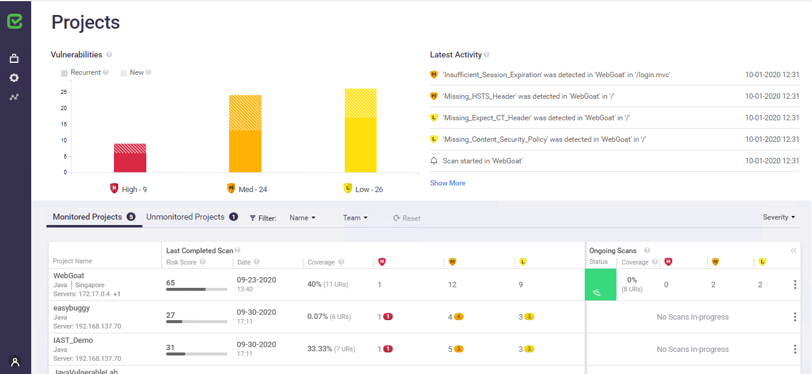

# Instrumenting WebGoat Legacy Container
* Author:   Pedric Kng  
* Updated:  01 Oct 2020

***
## Overview
This tutorial illustrates how to build and instrument a docker Java application with CxIAST
- Build OWASP WebGoat Legacy using docker 
- Instrument WebGoat Legacy using CxIAST to find vulnerabilities

## Step by step

**Step 1** : Git clone the Dockerized WebGoat Legacy project [[1]], and switch branch to 'Feature-awscodebuild'

```bash
git clone https://github.com/cx-demo/WebGoat-Legacy.git
git checkout Feature-awscodebuild
```
**Step 2** : Use maven to package the WebGoat Legacy project, the distribution should be available as target/WebGoat-6.0.1-war-exec.jar

```bash
mvn package
```

**Step 3** : Review the WebGoat Legacy [Dockerfile](https://github.com/cx-demo/WebGoat-Legacy/blob/Feature-awscodebuild/Dockerfile)


| Name          | Type          | Description         |
| ------------- |---------------|---------------------|
| WEBGOAT_VERSION      |   Build Argument   | Webgoat version, do not changed. Fixed as 6.0.1         |
| IAST_URL   | Env/Build Argument     | URL to IAST e.g., 192.168.137.70:8380 |
| IAST_SCANTAG        |   Env/Build Argument   | IAST scan tag, can be used to indicate versioning or destination |
| PORT       | Container port     | Expose port, can be remapped via '-p' argument |

**Step 4** : Build the docker image

```bash
# Optional to override the build arguments
export WEBGOAT_VERSION=6.0.1
export IAST_URL=192.168.137.70:8380
export IAST_SCANTAG=docker

# Build docker image with image name 'cxdemosg/webgoat-legacy:6.0.1'
docker build -t "cxdemosg/webgoat-legacy:6.0.1" --build-arg WEBGOAT_VERSION --build-arg IAST_URL --build-arg IAST_SCANTAG .
```

**Step 5** : Run the docker container named 'webgoat-legacy'

```bash
# Optional to override the env variables e.g., CxIAST machine URL
export IAST_URL=192.168.137.70:8380
export IAST_SCANTAG=docker

# Run the container
docker run --env IAST_URL --env IAST_SCANTAG -d -p 9000:9000 --name webgoat-legacy cxdemosg/webgoat-legacy:6.0.1
```

**Step6** : See the instrumentation on CxIAST Web UI


## References
Dockerized WebGoat Legacy [[1]]  

[1]:https://github.com/cx-demo/WebGoat-Legacy.git "Dockerized WebGoat Legacy"