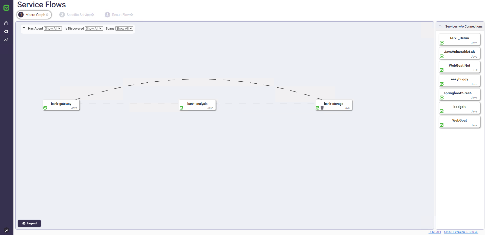
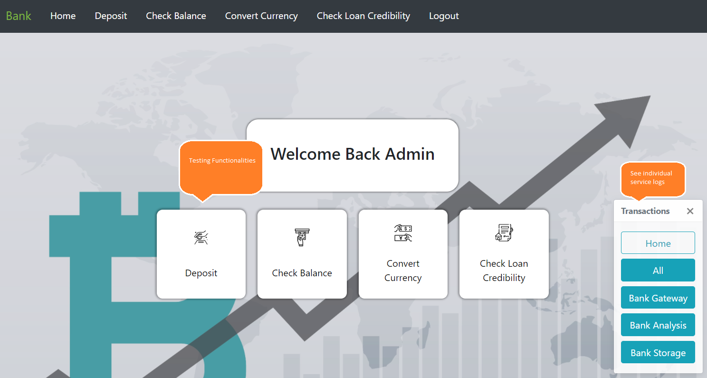
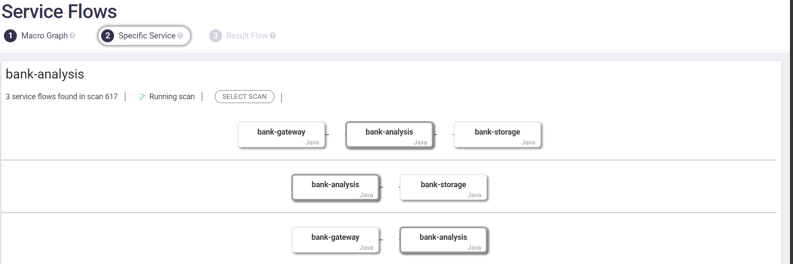
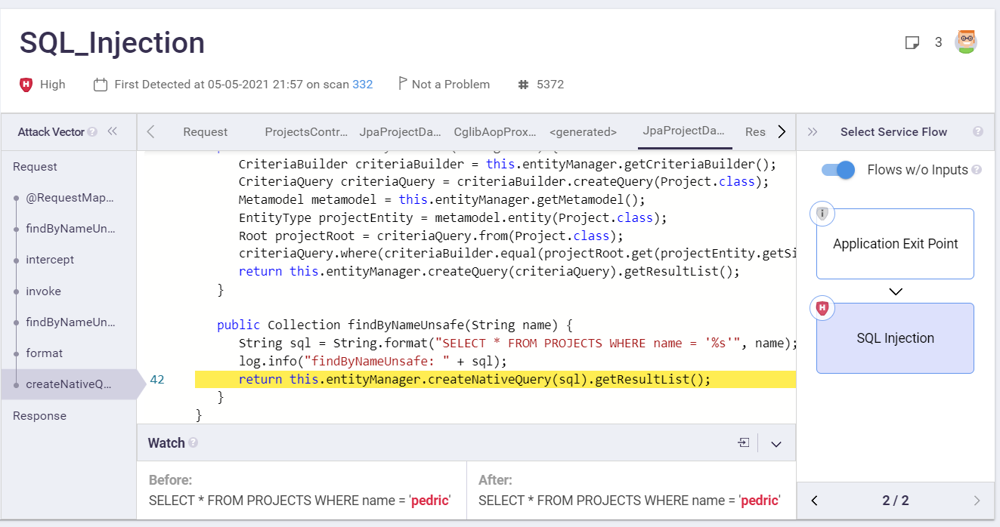
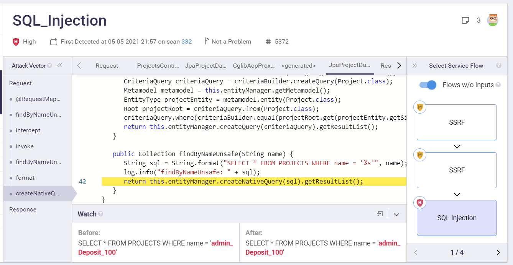
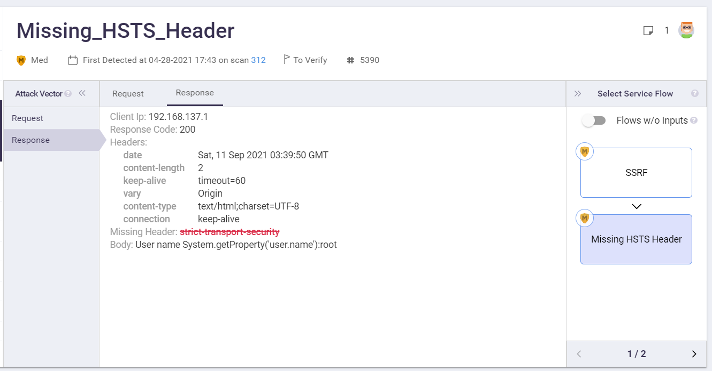

# Service flow example
* Author:   Pedric Kng  
* Updated:  11-Sep-21

This article describes the setup of a service flow [[1]] for CxIAST scan.

***
# Overview
Repository [[1]] contains various application based on microservices, in different languages and messaging technologies to illustrate the service flow capabilities in CxIAST. 

In this article, we will setup the Java variant which consists of 3 applications 'bank-gateway', 'bank-analysis' and 'bank-storage' and communicates via HTTP. 



# Pre-requisites
- CxIAST Java agent download
- Docker compose
- Network connectivity
    | Container | Type |Ports | 
    |----|---|---| 
    | Bank-gateway | Web Application | 8110 | 
    | Bank-analysis |  Web API | 8111 |
    | Bank-storage |  Web API |8112 |
    | CxIAST | Web Application & API |8380 | 

# Setup Java

1. Pull the java services from dockerhub
    ```bash
    # pull latest:
    sudo docker-compose -f docker-compose-java-http.yml pull
    ```
2. Edit configuration file '.env.linux'
    ```properties
    # .env.linux
    # Use this file in linux environemnts (where host.docker.internal doesn't work).
    # For example (in bash from the current diretory):
    # sudo docker-compose -f docker-compose-java-http.yml --env-file .env.linux up -d
    #
    # Delete the following parameter if you want to run the applications without IAST agents:
    IAST_MANAGER_URL=http://192.168.137.70:8380
    ```
3. Execute docker compose

    ```bash
    # start:
    sudo docker-compose -f docker-compose-java-http.yml --env-file .env.linux up -d
    ```
    The application portal 'bank gateway' is accessible at ``http://<url>:8110``, and you need to register for a new account. 

     

4. Use case scenarios

    

        !!! Make sure all the services are running before triggering the flow below.


    - Check Balance `Bank-gateway-> BankStorage`
        
        You can observe the flow across 2 services, triggering an SQL injection. Without service flow tracing, it will hard to tell where the malicious inputs are coming from. 
        

    - Deposit `Bank-gateway -> Bank-analysis -> BankStorage`
        
        Complex activity that involves 3 services, whereby bank-analysis will typically be doing some form of balance processing before committing it to records.
        

    - Convert currency `Bank-gateway -> Bank-analysis`

        This use case just involve analysis capability, therefore does not trigger any storage calls.
        

    - Check loan credibility `Bank-analysis -> BankStorage`

        ```sh
        # Send a http GET request below directly to 'Bank-analysis'
        # Replace ${text} with any string.
        http://<url>:8111/name?name=${text}
        ```

        This use case covers api tracing, where traffic does not have to be initiated through a UI.
            


5. Stop the service flow example.

    ```bash
    # stop:
    sudo docker-compose -f docker-compose-java-http.yml down
    ```


# References
Using Docker with Pipeline [[1]]  

[1]:https://github.com/yevgenykuz/service-discovery-demo-parent/ "Service Flow Example"