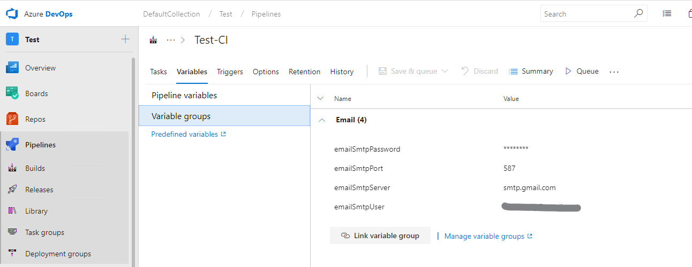
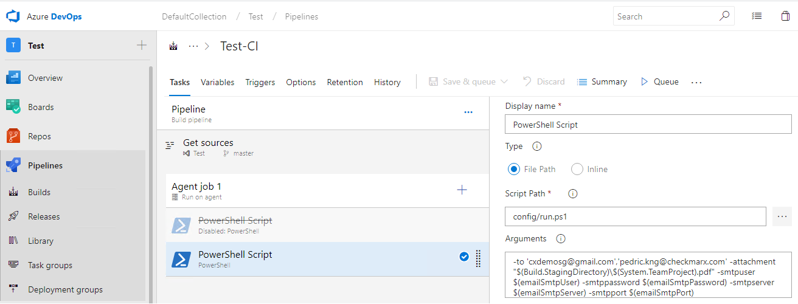
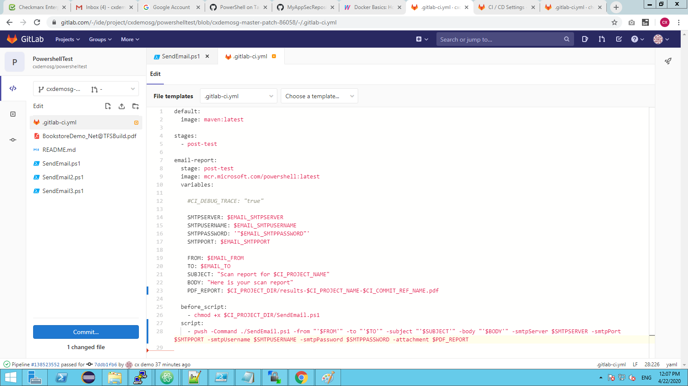
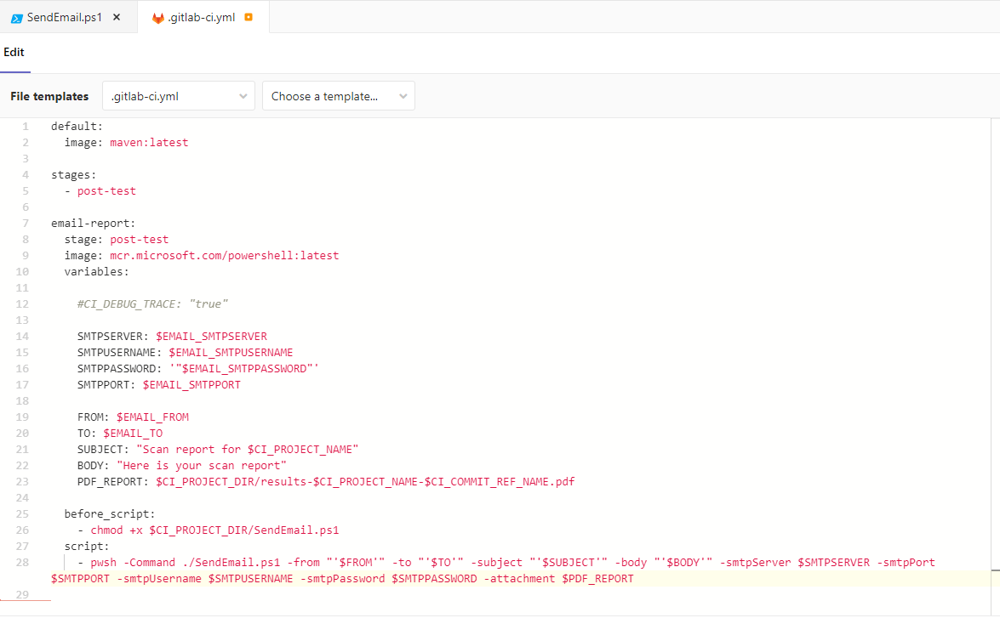

# Powershell script mailer
* Author: Pedric Kng
* Updated: 15 Apr 2020

Illustrate how to use powershell script to send email over SMTP


***
## Overview
This article will leverage on powershell script ['SendEmail.ps1'](SendEmail.ps1) to send email over SMTP. We will cover the following scenarios;
1. [Walkthrough powershell script](#Walkthrough-powershell-script)
2. [AzureDevOps Pipeline Integration](#AzureDevOps-Pipeline-Integration)
3. [Integration into Gitlab CI](#Integration-into-Gitlab-CI)


## Walkthrough powershell script
The powershell script ['SendEmail.ps1'](SendEmail.ps1) uses powershell function Send-MailMessage[[1]] to send out email messages, and encapsulates common arguments.

| Arguments     | Type               | Description               |
| ------------- |-----------|-----------------|
| -from            | String     | Email author|
| -to           | String[] | Receipients, support multiple separated by ',' |
| -subject            |  String | Email subject|
| -body            | String | Email Body|
| -attachments            | String[] | Attachments, support multiple separated by ','|
| -smtpServer            | String | SMTP Server URL|
| -smtpPort            | String | SMTP Server port|
| -smtpUsername            | String | SMTP login username|
| -smtpPassword            | String | SMTP login password|
| -deliveryNotificationOption            | String[] | Delivery notification option|


### Example usage
- See script parameters
```powershell
PS > Get-Help SendEmail.ps1 -Detailed
```

- Send email via Powershell
```powershell
PS > $from='no-reply <no-reply@gmail.com>'
PS > $to='user1 <user1@gmail.com>', 'user2 <user2@gmail.com>'
PS > $subject="email subject"
PS > $body="email body"
PS > $smtpServer="smtp.gmail.com"
PS > $smtpPort=587
PS > $smtpUsername="user1@gmail.com"
PS > $smtpPassword="********"
PS > ./SendEmail.ps1 -from $from -to $to -subject $subject -body $body -smtpServer $smtpServer -smtpPort $smtpPort -smtpUsername $smtpUsername -smtpPassword $smtpPassword
```

- Send email via Bash
```bash
from="no-reply <no-reply@gmail.com>"
to="user1 <user1@gmail.com>, user2 <user2@gmail.com>"
subject="email subject"
body="email body"
smtpServer="smtp.gmail.com"
smtpPort=587
smtpUsername="user1@gmail.com"
smtpPassword="********"
pwsh -Command ./SendEmail.ps1 -from "'$from'" -to "'$to'" -subject "'$subject'" -body "'$body'" -smtpServer $smtpServer -smtpPort $smtpPort -smtpUsername $smtpUsername -smtpPassword $smtpPassword
```


## AzureDevOps Pipeline Integration

1. Import script into local repository


2. Define the pipeline variables [[2]]

 You can leverage on variable group [[3]]

3. Configure the powershell script task in Pipeline


 ```Powershell
 # Arguments
 -to 'email1@gmail.com','email2@gmail.com' -attachment "$(Build.StagingDirectory)\$(System.TeamProject).pdf" -smtpuser $(emailSmtpUser) -smtppassword $(emailSmtpPassword) -smtpserver $(emailSmtpServer) -smtpport $(emailSmtpPort)
 ```
 Note that to pass String array argument, use single quotation mark to close string separated by comma ','.

## Integration into Gitlab CI

1. Declare variables in Gitlab CI variables



** Note that if the SMTP password contains special password;   
- Gitlab can only mask base64 compatible password [[4]]  
- Under the yml, password need to be specially processed with additional variable assignment and single quotation mark (') and (")

** Not to define variable that is of string array, separate via (,)

```yml
variables:
  SMTPPASSWORD: '"$EMAIL_SMTPPASSWORD"'
  script:
  - pwsh -Command ./SendEmail.ps1 ... -smtpPassword $SMTPPASSWORD
```

2. Configure the powershell script in GitLab CI



```yml
# .gitlab-ci.yml
default:
  image: maven:latest

stages:
  - post-test

email-report:
  stage: post-test
  image: mcr.microsoft.com/powershell:latest
  variables:

    #CI_DEBUG_TRACE: "true"

    SMTPSERVER: $EMAIL_SMTPSERVER
    SMTPUSERNAME: $EMAIL_SMTPUSERNAME
    SMTPPASSWORD: '"$EMAIL_SMTPPASSWORD"'
    SMTPPORT: $EMAIL_SMTPPORT

    FROM: $EMAIL_FROM
    TO: $EMAIL_TO
    SUBJECT: "Scan report for $CI_PROJECT_NAME"
    BODY: "Here is your scan report"
    PDF_REPORT: $CI_PROJECT_DIR/results-$CI_PROJECT_NAME-$CI_COMMIT_REF_NAME.pdf
    #DELIVERYNOTIFICATIONOPTION: OnSuccess

  before_script:
    - chmod +x $CI_PROJECT_DIR/SendEmail.ps1

  script:
    - pwsh -Command ./SendEmail.ps1 -from "'$FROM'" -to "'$TO'" -subject "'$SUBJECT'" -body "'$BODY'" -smtpServer $SMTPSERVER -smtpPort $SMTPPORT -smtpUsername $SMTPUSERNAME -smtpPassword $SMTPPASSWORD -attachment $PDF_REPORT
```

## References
Powershell Send-MailMessage [[1]]  
Define variables in Azure DevOps [[2]]  
Add & use variable groups [[3]]  
Masked variables [[4]]  

[1]:https://docs.microsoft.com/en-us/powershell/module/microsoft.powershell.utility/send-mailmessage "Powershell Send-MailMessage"
[2]:https://docs.microsoft.com/en-us/azure/devops/pipelines/process/variables?view=azure-devops&tabs=yaml%2Cbatch "Define variables in Azure DevOps"
[3]:https://docs.microsoft.com/en-us/azure/devops/pipelines/library/variable-groups?view=azure-devops "Add & use variable groups"
[4]:https://docs.gitlab.com/ee/ci/variables/#masked-variables "Masked variables"
