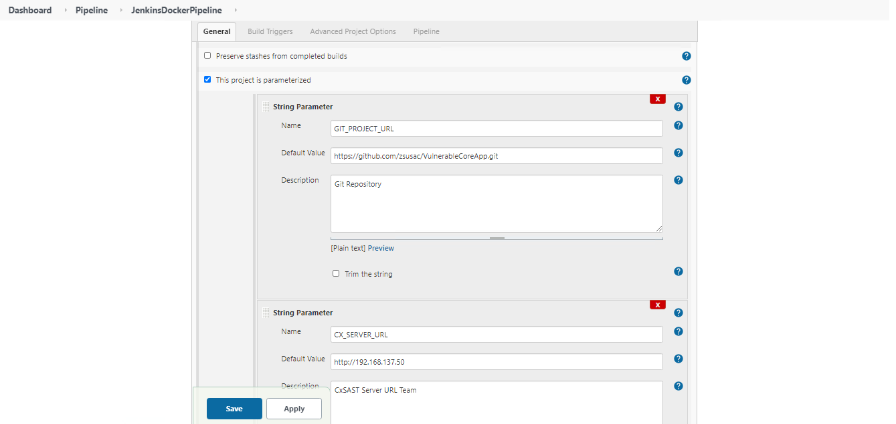
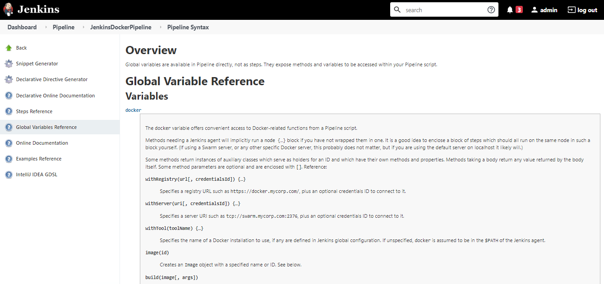

# Jenkins Docker Pipeline 
* Author:   Pedric Kng  
* Updated:  24 Dec 2020

This article describes the setup of a Jenkins docker pipeline [[1]] for Checkmarx scan.

***
## Overview
Jenkins Pipeline supports docker integration, a key proposition is in reducing the footprint of Jenkins plugins and tooling maintenance. This article will describe a simple setup for Checkmarx CxSAST and CxOSA scan using Dockerized CxCLI plugin.

## Pre-requisites
- Jenkins must be installed with Docker CLI, refer to [[2]] for an example setup
- Availability of CxCLI docker, refer to [[3]]
- Installed docker pipeline plugin [[4]]

## Configuration

1. Create Jenkins project of type 'Pipeline'

    

2. Setup the following pipeline parameters

    | Parameter | Description |
    | ------------- | ------------- |
    | GIT_PROJECT_URL | Project GIT URL|
    | CX_SERVER_URL | CxSAST URL |
    | CX_TEAM | CxSAST Project Team |
    | CX_PROJECT_NAME | CxSAST Project Name |  

    These parameters will be used in the CxCLI [[7]] arguments to execute CxSAST & CxOSA scans

    

3. Configure the [Pipeline script] (Jenkinsfile)

    The example defines 2 tests in parallel
    i. Resolve dependency - resolve dotnet dependencies
    ii. CxDockerCLI - execute CxSAST & CxSCA Scans

    ```groovy
    // Scripted pipeline, the equivalent can be implemented for declarative pipeline

    node {
        
        parameters {
        // Source code repository
        string(name: 'GIT_PROJECT_URL', defaultValue: 'https://github.com/WebGoat/WebGoat-Legacy.git', description: 'Git Repository')
        // Checkmarx server URL
        string(name: 'CX_SERVER_URL', defaultValue: 'http://192.168.137.50', description: 'CxSAST Server URL Team')
        // Checkmarx project team is hardcoded to CxServer
        string(name: 'CX_TEAM', defaultValue: 'CxServer', description: 'CxSAST Project Team e.g.,CxServer\\SP\\Corp ')
        // Checkmarx project name
        string(name: 'CX_PROJECT_NAME', defaultValue: 'WebGoat-Legacy', description: 'CxSAST Project Name')
        // Checkmarx CxCLI Token
        string(name: 'CX_TOKEN', defaultValue: 'a750bccb1d176a137e0287152e6fe1c971242270f8888f56bcea09ddfd525059', description: 'CxCLI Token')

        }
        
        sh 'echo "Get some code from an SCM"'
        checkout([$class: 'GitSCM',
        branches: [[name: '*/master']],
        doGenerateSubmoduleConfigurations: false,
        extensions: [],
        submoduleCfg: [],
        userRemoteConfigs: [[url: "${params.GIT_PROJECT_URL}"]]])
        
        def test = [:]
        
        test["Unit Test"] = {
            stage('Resolve dependency') {
                docker.image('mcr.microsoft.com/dotnet/sdk:3.1').inside('-u root:sudo') {
                    sh 'dotnet --info'
                    sh 'dotnet restore -v n --force-evaluate --use-lock-file'
                }            
            }
        
        }
        
        test["Security Test"] = {
            stage('CxDockerCLI') {
                docker.image('cxdockercli/dotnet:2020.4.4').inside("-u root:sudo --entrypoint ''") {
                    sh "/opt/cxcli/runCxConsole.sh Scan -v -CxServer ${params.CX_SERVER_URL} -CxToken ${params.CX_TOKEN} -ProjectName '${params.CX_TEAM}\\${params.CX_PROJECT_NAME}' -LocationType folder -LocationPath ${WORKSPACE} -enableosa -executepackagedependency"
                }
            }    
        }
        
        parallel test
    }

    ```

    The scripted pipeline leverages on CxDockerCLI [[3]] to execute SAST and OSA scan, where CxCLI arguments corresponds to the respective Jenkins parameters.

    *Note that the CxDockerCLI 'entrypoint' is overridden as image().inside()_ will mount the workspace containing the checkout source. 

    You can find more details from Jenkins Dashboard > Pipeline > [Project Name] > Pipeline Syntax > Global Variable Reference

    

# References
Using Docker with Pipeline [[1]]  
Adding docker execution environment for Jenkins [[2]]  
CxDockerCLI [[3]]  
Docker Pipeline plugin [[4]]
Checkmarx CxCLI Guide [[7]]

[1]:https://www.jenkins.io/doc/book/pipeline/docker/ "Using Docker with Pipeline"
[2]:https://github.com/cx-demo/myjenkins#adding-docker-execution-environment-for-jenkins "Adding docker execution environment for Jenkins"
[3]:https://github.com/cx-demo/CxDockerCLI "CxDockerCLI"
[4]:https://docs.cloudbees.com/docs/admin-resources/latest/plugins/docker-workflow "Docker Pipeline plugin"
[5]:https://www.jenkins.io/blog/2018/08/17/speaker-blog-brent-laster/ "Using the Docker Global Variable in Your Jenkins Pipeline "
[6]:https://www.jenkins.io/doc/book/pipeline/jenkinsfile/ "Using a Jenkinsfile"
[7]:https://checkmarx.atlassian.net/wiki/spaces/KC/pages/44335590/CxSAST+CLI+Guide "Checkmarx CxCLI Guide"
