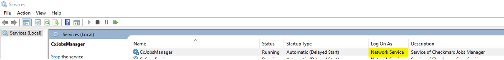

# Troubleshooting post scan action on CxSAST
* Author:   Pedric Kng  
* Updated:  03 Feb 2021

This article describes the troubleshooting of post scan action not been invoked properly with CxSAST

***
# Troubleshooting steps

1. Lookup logs in JobsManager, all pre and post scan actions are performed by it.  
*Log file location - C:\Program Files\Checkmarx\Logs\JobsManager*

2. Ensure that the fields populated are correct.  
E.g., in [[1]], a very common error is missing out the ';' as separator for .bat arguments

3. Validate that the .bat and powershell script is runnable  
Execute the scripts in DOS and Powershell to ensure that it works well.

    ```bash
    send_report.bat "C:\CxReports\WebGoat-Legacy.pdf";"cxdemosg@gmail.com"
    ```

    ```powershell
    PowerShell.exe -Command " & 'C:\Program Files\Checkmarx\Executables\genreport.ps1' -t '"cxdemosg@gmail.com"' -a '"C:\CxReports\WebGoat-Legacy.pdf"'"
    ```

4. Validate scripts are executable using service account that CxSAST runs on.

    a. Run the Command Prompt Line (cmd.exe) with elevated privileges 

    b. Use the next steps to run the scan action with the right user (the user that is running the CxJobsManager service)

    

    Common accounts is NETWORK_SERVICE and LOCAL_SYSTEM, this can be verified via the 'services.msc' panel

    c. Use PsExec.exe from SysInternals, running from an elevated command prompt.

    e.g. this will open a new command prompt running as NETWORK SERVICE:

    ```bash
    psexec -i -u "nt authority\network service" cmd.exe 
    ```

    this will run it as LOCAL SYSTEM:

    ```bash
    psexec -i -s cmd.exe 
    ```
    d. Run the scan action to troubleshoot the behavior of the script.bat.


## References
How to Send a Detailed PDF Report via Email [[1]]  
PsExec [[2]]
 
[1]: https://checkmarx.force.com/CheckmarxCustomerServiceCommunity/s/article/How-to-Send-a-Detailed-PDF-Report-via-Email "How to Send a Detailed PDF Report via Email"  
[2]:https://docs.microsoft.com/en-us/sysinternals/downloads/psexec "PsExec"